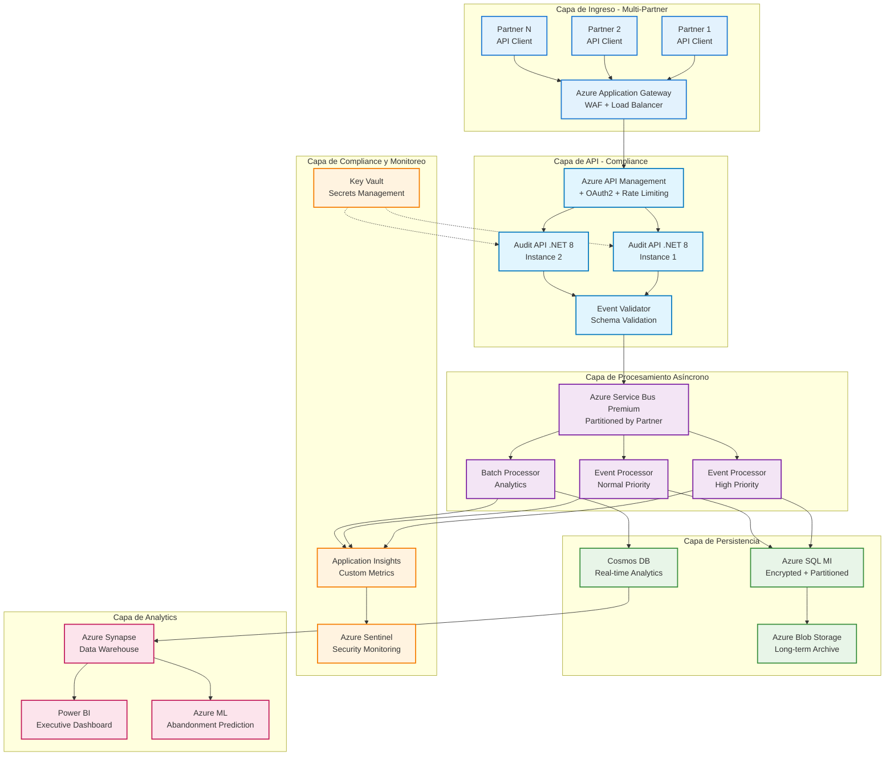

# API de Auditoría para Originación de Tarjetas de Crédito - Bradescard México

## Contexto del Negocio

**Bradescard México** - Empresa financiera especializada en tarjetas de crédito y departamentales que trabaja con **partners comerciales externos** para la originación de créditos. Los partners manejan sus propios procesos tecnológicos y tocan base con Bradescard en puntos críticos del flujo de originación.

### Partners Tecnológicos Identificados

#### **1. Buró Identidad (www.buroidentidad.com)**
- **Servicios**: Digital Onboarding, Validación Biométrica, Firma Digital
- **Capacidades**:
  - **Photo ID OCR**: Extracción automática de datos de documentos oficiales
  - **Captura Facial**: Tecnología de reconocimiento facial
  - **3D Liveness**: Pruebas de vida avanzadas anti-spoofing
  - **Facematch**: Comparación facial documento vs. selfie
  - **OTPS**: One Time Password Services
  - **BID Sign**: Firma digital certificada eIDAS
- **Integración**: APIs REST para cada componente biométrico

#### **2. Business Rules Engine / Scoring Partners (Típicos en México)**
- **FICO México**: Modelos de scoring crediticio y motor de reglas
- **SAS Risk Management**: Plataforma de gestión de riesgo crediticio
- **Equifax Veraz**: Scoring y business rules locales
- **Trans Union México**: Modelos predictivos y reglas de negocio
- **Providers Locales**: Motores de reglas personalizados para Bradescard

### Objetivo de la Bitácora
- **Auditoría completa** del proceso de originación de tarjetas de crédito
- **Trazabilidad** de los 10,000 casos mensuales aproximadamente  
- **Análisis de abandono** del ~30% de casos que no avanzan
- **Compliance** con regulaciones financieras mexicanas (CNBV, Condusef)
- **Interfaz genérica** para múltiples partners actuales y futuros

## Taxonomía Estándar de Eventos de Originación

### Proceso Estándar de Originación de Tarjetas de Crédito

```mermaid
graph TB
    subgraph "Partner Externo"
        INIT[Inicio Solicitud<br/>ORIGINATION_STARTED]
        DATA[Captura Datos<br/>DATA_COLLECTION_COMPLETED]
        VALID[Validación Inicial<br/>INITIAL_VALIDATION_COMPLETED]
    end
    
    subgraph "Buró Identidad - Digital Onboarding"
        BID_INIT[Inicio Onboarding<br/>DIGITAL_ONBOARDING_STARTED]
        PHOTO_ID[Captura ID Oficial<br/>PHOTO_ID_CAPTURE_COMPLETED]
        OCR_PROC[Procesamiento OCR<br/>OCR_PROCESSING_COMPLETED]
        FACIAL_CAP[Captura Facial<br/>FACIAL_CAPTURE_COMPLETED]
        LIVENESS[Prueba Liveness<br/>LIVENESS_CHECK_COMPLETED]
        FACEMATCH[Face Match<br/>FACEMATCH_VALIDATION_COMPLETED]
        BID_SIGN[Firma Digital<br/>DIGITAL_SIGNATURE_COMPLETED]
    end
    
    subgraph "Bradescard - Validaciones"
        BURO[Consulta Buró<br/>BUREAU_QUERY_REQUESTED]
        BURO_RESP[Respuesta Buró<br/>BUREAU_RESPONSE_RECEIVED]
    end
    
    subgraph "Business Rules Engine - Scoring"
        BRE_INIT[Inicio Motor Reglas<br/>BUSINESS_RULES_ENGINE_STARTED]
        RULE_EVAL[Evaluación Reglas<br/>BUSINESS_RULES_EVALUATED]
        SCORE_CALC[Cálculo Score<br/>SCORE_CALCULATION_COMPLETED]
        RISK_ASSESS[Evaluación Riesgo<br/>RISK_ASSESSMENT_COMPLETED]
        LIMIT_CALC[Cálculo Límite<br/>CREDIT_LIMIT_CALCULATED]
    end
    
    subgraph "Partner Externo - Decisión"
        DECISION[Análisis Decisión<br/>DECISION_ANALYSIS_STARTED]
        APPROVED[Pre-Aprobación<br/>PRE_APPROVAL_GRANTED]
        REJECTED[Rechazo<br/>APPLICATION_REJECTED]
    end
    
    subgraph "Bradescard - Core Bancario"
        CORE_REQ[Solicitud Alta Core<br/>CORE_REGISTRATION_REQUESTED]
        CORE_VALID[Validación Core<br/>CORE_VALIDATION_COMPLETED]
        CORE_SUCCESS[Cliente Registrado<br/>CORE_REGISTRATION_COMPLETED]
        CORE_ERROR[Error Core<br/>CORE_REGISTRATION_FAILED]
    end
    
    subgraph "Finalización"
        CARD_GEN[Generación Tarjeta<br/>CARD_GENERATION_STARTED]
        CARD_READY[Tarjeta Lista<br/>CARD_PRODUCTION_COMPLETED]
        DELIVERY[Entrega<br/>CARD_DELIVERY_INITIATED]
        ACTIVATED[Activación<br/>CARD_ACTIVATED]
        COMPLETED[Proceso Completado<br/>ORIGINATION_COMPLETED]
    end
    
    INIT --> DATA
    DATA --> VALID
    VALID --> BID_INIT
    BID_INIT --> PHOTO_ID
    PHOTO_ID --> OCR_PROC
    OCR_PROC --> FACIAL_CAP
    FACIAL_CAP --> LIVENESS
    LIVENESS --> FACEMATCH
    FACEMATCH --> BID_SIGN
    BID_SIGN --> BURO
    BURO --> BURO_RESP
    BURO_RESP --> BRE_INIT
    BRE_INIT --> RULE_EVAL
    RULE_EVAL --> SCORE_CALC
    SCORE_CALC --> RISK_ASSESS
    RISK_ASSESS --> LIMIT_CALC
    LIMIT_CALC --> DECISION
    
    DECISION --> APPROVED
    DECISION --> REJECTED
    
    APPROVED --> CORE_REQ
    CORE_REQ --> CORE_VALID
    CORE_VALID --> CORE_SUCCESS
    CORE_VALID --> CORE_ERROR
    
    CORE_SUCCESS --> CARD_GEN
    CARD_GEN --> CARD_READY
    CARD_READY --> DELIVERY
    DELIVERY --> ACTIVATED
    ACTIVATED --> COMPLETED
    
    REJECTED --> END_REJECTED[FIN RECHAZADO]
    CORE_ERROR --> END_ERROR[FIN ERROR]
    
    classDef partnerStyle fill:#e3f2fd,stroke:#1976d2,stroke-width:2px
    classDef bradesStyle fill:#e8f5e8,stroke:#388e3c,stroke-width:2px
    classDef decisionStyle fill:#fff3e0,stroke:#f57c00,stroke-width:2px
    classDef errorStyle fill:#ffebee,stroke:#c62828,stroke-width:2px
    
    class INIT,DATA,VALID,DECISION partnerStyle
    class BID_INIT,PHOTO_ID,OCR_PROC,FACIAL_CAP,LIVENESS,FACEMATCH,BID_SIGN partnerStyle
    class BURO,BURO_RESP,CORE_REQ,CORE_VALID,CORE_SUCCESS bradesStyle
    class BRE_INIT,RULE_EVAL,SCORE_CALC,RISK_ASSESS,LIMIT_CALC bradesStyle
    class APPROVED,REJECTED,CARD_GEN,CARD_READY,DELIVERY,ACTIVATED,COMPLETED decisionStyle
    class CORE_ERROR,END_REJECTED,END_ERROR errorStyle
```



## Catálogo de Eventos Estándar

### 1. **Eventos de Inicio y Captura (Partner)**
| Evento | Descripción | Datos Requeridos |
|--------|-------------|------------------|
| `ORIGINATION_STARTED` | Inicio del proceso de originación | `applicationId`, `partnerId`, `productType`, `channel` |
| `DATA_COLLECTION_STARTED` | Inicio captura de datos del solicitante | `applicationId`, `step`, `formType` |
| `DATA_COLLECTION_COMPLETED` | Captura de datos completada | `applicationId`, `dataFields`, `completeness` |
| `INITIAL_VALIDATION_STARTED` | Inicio validaciones básicas | `applicationId`, `validationType` |
| `INITIAL_VALIDATION_COMPLETED` | Validaciones iniciales completadas | `applicationId`, `validationResult`, `errors` |

### 2. **Eventos de Digital Onboarding Biométrico (Buró Identidad)**
| Evento | Descripción | Datos Requeridos |
|--------|-------------|------------------|
| `DIGITAL_ONBOARDING_STARTED` | Inicio proceso onboarding digital | `applicationId`, `onboardingSession`, `deviceInfo`, `ipAddress` |
| `PHOTO_ID_CAPTURE_STARTED` | Inicio captura documento oficial | `applicationId`, `documentType`, `captureMethod` |
| `PHOTO_ID_CAPTURE_COMPLETED` | Captura de documento completada | `applicationId`, `documentImages`, `quality`, `timestamp` |
| `OCR_PROCESSING_STARTED` | Inicio procesamiento OCR | `applicationId`, `ocrProvider`, `documentType` |
| `OCR_PROCESSING_COMPLETED` | OCR procesado exitosamente | `applicationId`, `extractedData`, `confidence`, `validationFlags` |
| `OCR_PROCESSING_FAILED` | Fallo en procesamiento OCR | `applicationId`, `errorCode`, `errorReason`, `retryable` |
| `FACIAL_CAPTURE_STARTED` | Inicio captura biométrica facial | `applicationId`, `biometricSession`, `deviceCapabilities` |
| `FACIAL_CAPTURE_COMPLETED` | Captura facial completada | `applicationId`, `biometricTemplate`, `quality`, `attempts` |
| `LIVENESS_CHECK_STARTED` | Inicio prueba de vida | `applicationId`, `livenessType`, `challengeType` |
| `LIVENESS_CHECK_COMPLETED` | Prueba de vida completada | `applicationId`, `livenessResult`, `confidence`, `spoofingDetected` |
| `LIVENESS_CHECK_FAILED` | Fallo en prueba de vida | `applicationId`, `failureReason`, `suspiciousActivity`, `retryAllowed` |
| `FACEMATCH_VALIDATION_STARTED` | Inicio validación facial | `applicationId`, `referenceImage`, `candidateImage` |
| `FACEMATCH_VALIDATION_COMPLETED` | Validación facial completada | `applicationId`, `matchScore`, `threshold`, `matchResult` |
| `DIGITAL_SIGNATURE_STARTED` | Inicio firma digital | `applicationId`, `documentHash`, `signatureMethod` |
| `DIGITAL_SIGNATURE_COMPLETED` | Firma digital completada | `applicationId`, `signatureData`, `certificate`, `timestamp` |
| `DIGITAL_ONBOARDING_COMPLETED` | Onboarding digital completado | `applicationId`, `overallScore`, `fraudIndicators`, `recommendations` |

### 3. **Eventos de Consultas Externas (Bradescard)**
| Evento | Descripción | Datos Requeridos |
|--------|-------------|------------------|
| `BUREAU_QUERY_REQUESTED` | Solicitud consulta buró de crédito | `applicationId`, `bureauProvider`, `queryType`, `curp` |
| `BUREAU_RESPONSE_RECEIVED` | Respuesta de buró recibida | `applicationId`, `bureauScore`, `riskLevel`, `recommendations` |
| `BUREAU_QUERY_FAILED` | Fallo en consulta buró | `applicationId`, `errorCode`, `providerError`, `retryable` |

### 4. **Eventos de Business Rules Engine y Scoring**
| Evento | Descripción | Datos Requeridos |
|--------|-------------|------------------|
| `BUSINESS_RULES_ENGINE_STARTED` | Inicio motor reglas de negocio | `applicationId`, `rulesetVersion`, `inputParameters` |
| `BUSINESS_RULES_EVALUATED` | Reglas de negocio evaluadas | `applicationId`, `rulesExecuted`, `ruleResults`, `overrides` |
| `RISK_VARIABLES_CALCULATED` | Variables de riesgo calculadas | `applicationId`, `variables`, `dataSourced`, `weights` |
| `SCORE_CALCULATION_STARTED` | Inicio cálculo score crediticio | `applicationId`, `scoreModel`, `modelVersion`, `inputData` |
| `SCORE_CALCULATION_COMPLETED` | Score crediticio calculado | `applicationId`, `finalScore`, `scoreComponents`, `confidence` |
| `RISK_ASSESSMENT_COMPLETED` | Evaluación de riesgo completada | `applicationId`, `riskLevel`, `riskFactors`, `mitigations` |
| `CREDIT_LIMIT_CALCULATION_STARTED` | Inicio cálculo límite crédito | `applicationId`, `policyRules`, `baseLimit` |
| `CREDIT_LIMIT_CALCULATED` | Límite de crédito calculado | `applicationId`, `recommendedLimit`, `limitFactors`, `restrictions` |
| `POLICY_RULES_APPLIED` | Reglas de política aplicadas | `applicationId`, `appliedPolicies`, `exceptions`, `approvals` |
| `FRAUD_SCREENING_COMPLETED` | Screening antifraude completado | `applicationId`, `fraudScore`, `fraudIndicators`, `action` |

### 5. **Eventos de Decisión (Partner)**
| Evento | Descripción | Datos Requeridos |
|--------|-------------|------------------|
| `DECISION_ANALYSIS_STARTED` | Inicio análisis de decisión | `applicationId`, `decisionEngine`, `criteria` |
| `PRE_APPROVAL_GRANTED` | Pre-aprobación otorgada | `applicationId`, `approvedLimit`, `productOffered`, `conditions` |
| `APPLICATION_REJECTED` | Solicitud rechazada | `applicationId`, `rejectionReason`, `rejectionCode`, `appealOption` |
| `MANUAL_REVIEW_REQUIRED` | Requiere revisión manual | `applicationId`, `reviewReason`, `assignedAnalyst` |

### 6. **Eventos de Core Bancario (Bradescard)**
| Evento | Descripción | Datos Requeridos |
|--------|-------------|------------------|
| `CORE_REGISTRATION_REQUESTED` | Solicitud alta en core bancario | `applicationId`, `customerData`, `productConfig` |
| `CORE_VALIDATION_COMPLETED` | Validación en core completada | `applicationId`, `validationStatus`, `customerId` |
| `CORE_REGISTRATION_COMPLETED` | Cliente registrado exitosamente | `applicationId`, `customerId`, `accountNumber`, `cardNumber` |
| `CORE_REGISTRATION_FAILED` | Fallo en registro de core | `applicationId`, `errorCode`, `errorDescription`, `retryable` |

### 7. **Eventos de Producción y Entrega**
| Evento | Descripción | Datos Requeridos |
|--------|-------------|------------------|
| `CARD_GENERATION_STARTED` | Inicio generación de tarjeta | `applicationId`, `customerId`, `cardType`, `deliveryAddress` |
| `CARD_PRODUCTION_COMPLETED` | Tarjeta producida | `applicationId`, `cardNumber`, `expirationDate`, `trackingNumber` |
| `CARD_DELIVERY_INITIATED` | Envío de tarjeta iniciado | `applicationId`, `carrier`, `trackingNumber`, `estimatedDelivery` |
| `CARD_DELIVERED` | Tarjeta entregada | `applicationId`, `deliveryDate`, `recipientName` |
| `CARD_ACTIVATED` | Tarjeta activada por cliente | `applicationId`, `activationDate`, `activationChannel` |
| `ORIGINATION_COMPLETED` | Proceso completado exitosamente | `applicationId`, `completionDate`, `totalProcessTime` |

### 8. **Eventos de Error y Abandono**
| Evento | Descripción | Datos Requeridos |
|--------|-------------|------------------|
| `PROCESS_ABANDONED` | Cliente abandonó el proceso | `applicationId`, `lastStep`, `timeToAbandon`, `abandoReason` |
| `SYSTEM_ERROR` | Error de sistema | `applicationId`, `errorType`, `systemComponent`, `errorDetails` |
| `TIMEOUT_ERROR` | Timeout en proceso | `applicationId`, `timeoutStep`, `maxWaitTime`, `actualWaitTime` |
| `VALIDATION_ERROR` | Error de validación | `applicationId`, `validationField`, `errorMessage`, `correctionRequired` |

## Arquitectura Rediseñada para Auditoría Financiera



## Estructura de Mensaje Estándar

### Esquema JSON para Eventos de Auditoría

```json
{
  "$schema": "https://bradescard.mx/schemas/origination-audit-event-v1.0.json",
  "eventHeader": {
    "eventId": "evt_20241226_001234567",
    "eventType": "BUREAU_QUERY_REQUESTED", 
    "eventTimestamp": "2024-12-26T10:30:45.123Z",
    "eventVersion": "1.0",
    "partnerId": "PARTNER_AMAZON_MX",
    "partnerName": "Amazon México Credit Card",
    "sourceSystem": "AMAZON_ORIGINATION_ENGINE",
    "correlationId": "corr_app_98765432101",
    "sessionId": "session_abc123def456"
  },
  "applicationContext": {
    "applicationId": "APP_2024_98765432101",
    "productType": "CREDIT_CARD_AMAZON_PRIME",
    "productCategory": "CREDIT_CARD",
    "channel": "ONLINE_WEB",
    "campaignId": "CAMP_AMAZON_Q4_2024",
    "referralCode": "REF_AMAZON_PRIME_USER"
  },
  "customerContext": {
    "customerId": null,
    "curp": "CURP901234HDFXXX05",
    "rfc": null,
    "phoneNumber": "+52xxxxxxxxxx",
    "email": "customer@email.com",
    "riskSegment": "MEDIUM_RISK",
    "isExistingCustomer": false
  },
  "eventData": {
    // Para eventos biométricos (Buró Identidad)
    "biometricSession": "bio_sess_20241226_001",
    "documentType": "INE",
    "captureMethod": "CAMERA_WEB",
    "biometricQuality": 0.95,
    "livenessScore": 0.92,
    "facematchScore": 0.89,
    "ocrConfidence": 0.97,
    "fraudIndicators": ["NONE"],
    
    // Para eventos de scoring (Business Rules Engine)
    "rulesetVersion": "BRE_v3.2.1", 
    "scoreModel": "BRADESCARD_PRIME_V4",
    "finalScore": 720,
    "riskLevel": "MEDIUM",
    "recommendedLimit": 25000.00,
    "policyOverrides": [],
    
    // Para eventos de buró (cuando aplique)
    "bureauProvider": "CIRCULO_CREDITO",
    "queryType": "FULL_REPORT_PLUS_SCORE",
    "requestedProducts": ["CREDIT_BUREAU", "IDENTITY_VERIFICATION"],
    "queryReason": "CREDIT_APPLICATION",
    "consentTimestamp": "2024-12-26T10:25:30.123Z",
    "consentVersion": "v2.1"
  },
  "businessMetrics": {
    "stepNumber": 5,
    "totalStepsExpected": 12,
    "timeInCurrentStep": 180,
    "totalProcessTime": 1200,
    "isFirstAttempt": true,
    "retryCount": 0
  },
  "technicalContext": {
    "requestId": "req_67890abcdef",
    "apiVersion": "v1.2",
    "userAgent": "Mozilla/5.0 (Partner Integration v2.1)",
    "ipAddress": "192.168.1.100",
    "responseTime": 250,
    "httpStatusCode": 200
  },
  "complianceData": {
    "dataClassification": "PERSONAL_FINANCIAL",
    "retentionPeriod": "P7Y",
    "encryptionLevel": "AES_256",
    "accessControlLevel": "RESTRICTED",
    "auditRequired": true,
    "piiFields": ["curp", "phoneNumber", "email"]
  }
}
```

## API Endpoints Especializados

### 1. **Endpoint Principal de Auditoría**
```
POST /api/v1/audit/origination/events
Content-Type: application/json
Authorization: Bearer {jwt_token}
X-Partner-ID: {partner_identifier}
X-Request-ID: {unique_request_id}
```

### 2. **Endpoints de Consulta**
```
GET /api/v1/audit/applications/{applicationId}/timeline
GET /api/v1/audit/applications/{applicationId}/events
GET /api/v1/audit/partners/{partnerId}/metrics
GET /api/v1/audit/events/search?eventType={type}&dateFrom={date}&dateTo={date}
```

### 3. **Endpoints de Analytics**
```
GET /api/v1/analytics/abandonment/rates
GET /api/v1/analytics/conversion/funnel
GET /api/v1/analytics/performance/partners
GET /api/v1/analytics/compliance/reports
```

---

**Próximo paso**: ¿Te gustaría que profundice en la implementación del código de la API, el esquema detallado de base de datos, o las configuraciones de compliance específicas para el sector financiero mexicano?