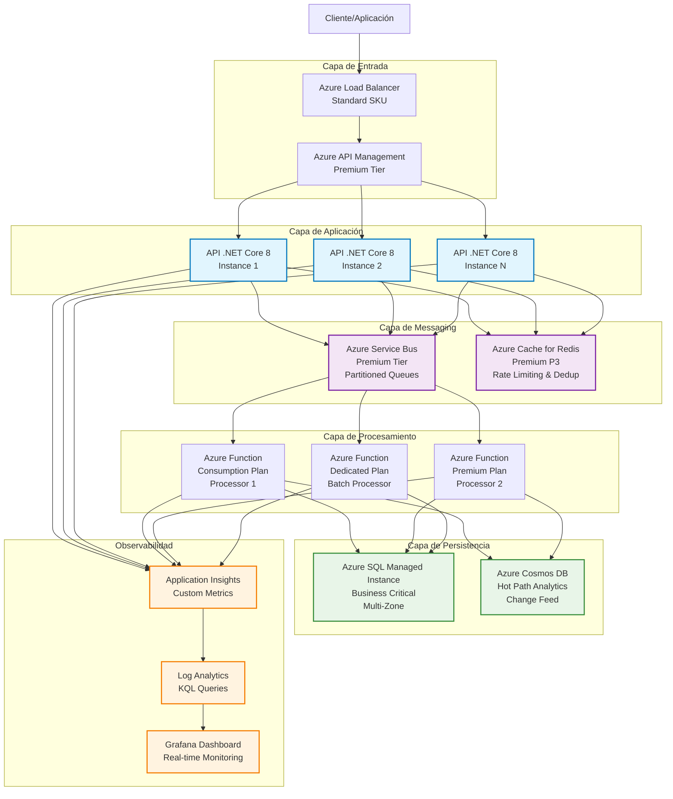
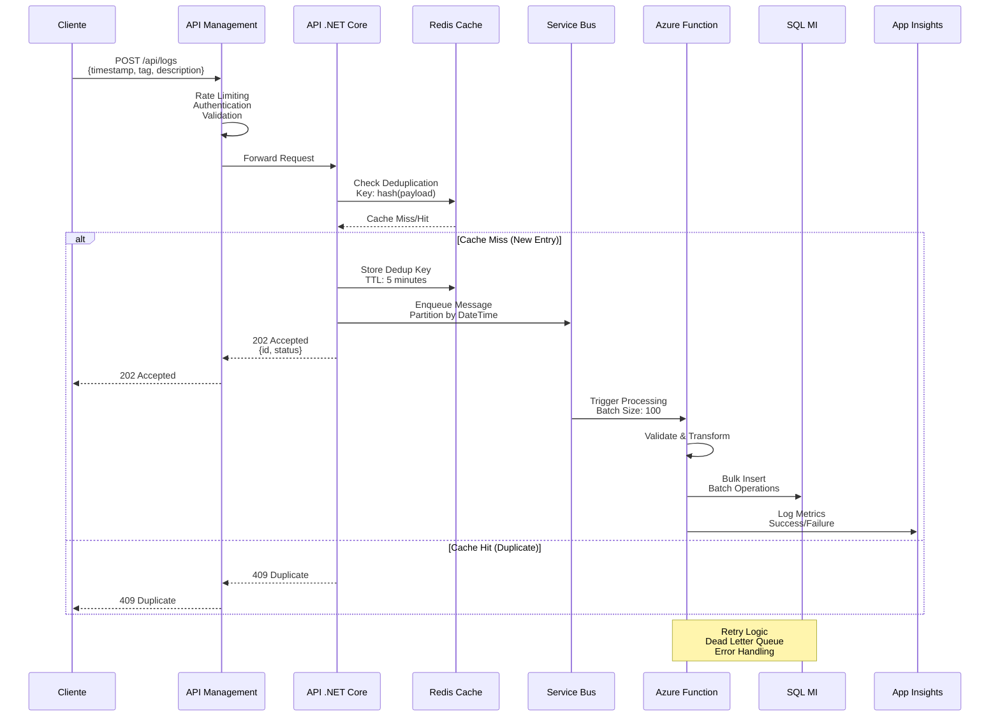
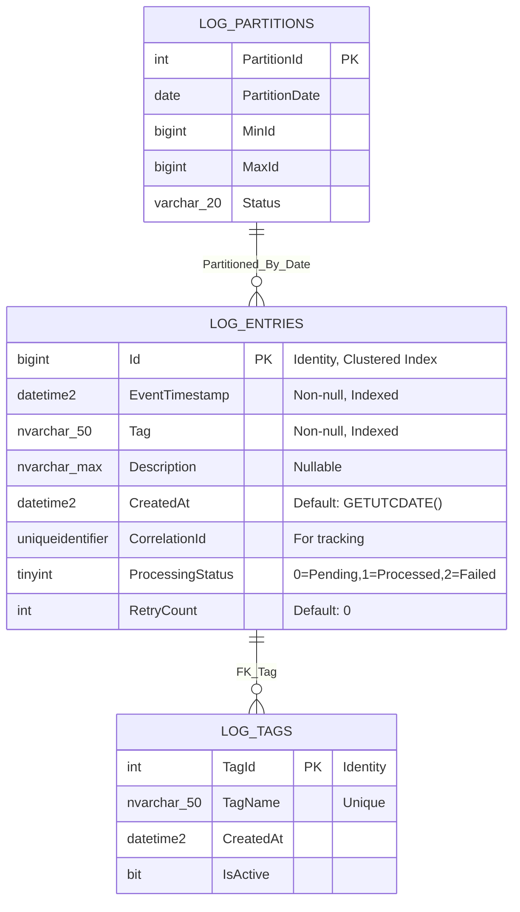

# Arquitectura API de Bitácora de Alto Rendimiento

## Visión General
Esta arquitectura está diseñada para manejar miles de transacciones por segundo para una API de bitácora, implementando patrones de encolamiento, procesamiento asíncrono y optimizaciones de base de datos.

## Diagrama Principal de Arquitectura



## Diagrama de Flujo de Datos Detallado



## Esquema de Base de Datos Optimizado



## Componentes Clave y Mejoras Arquitectónicas

### 1. **API Gateway y Load Balancing**
- **Azure API Management**: Throttling, authentication, caching
- **Azure Load Balancer**: Distribución de carga con health checks
- **Rate Limiting**: 10,000 requests/minute por cliente

### 2. **Encolamiento y Procesamiento Asíncrono**
- **Azure Service Bus Premium**: 
  - Partitioned queues para mayor throughput
  - Dead letter queues para manejo de errores
  - Duplicate detection habilitada
- **Redis Cache**: Deduplicación y rate limiting en memoria

### 3. **Optimizaciones de Base de Datos**
```sql
-- Índices optimizados para consultas frecuentes
CREATE CLUSTERED INDEX IX_LogEntries_Id ON LogEntries(Id)
CREATE NONCLUSTERED INDEX IX_LogEntries_EventTimestamp_Tag 
    ON LogEntries(EventTimestamp DESC, Tag) 
    INCLUDE (Description, CorrelationId)

-- Particionamiento por fecha para mejor rendimiento
CREATE PARTITION SCHEME PS_LogEntries_Date 
    AS PARTITION PF_LogEntries_Date TO ([PRIMARY], [PARTITION_2024_01], [PARTITION_2024_02], ...)
```

### 4. **Escalabilidad y Rendimiento**
- **Auto-scaling**: Basado en métricas de CPU, memoria y cola
- **Connection pooling**: Optimizado para .NET Core
- **Bulk operations**: Inserts en lotes de 100-1000 registros
- **Read replicas**: Para consultas de reporting

### 5. **Monitoreo y Observabilidad**
- **Application Insights**: Métricas personalizadas, trazabilidad
- **KQL Queries**: Alertas proactivas y dashboards
- **Health checks**: Endpoints para validar estado de servicios

## Especificaciones Técnicas Recomendadas

### Azure SQL Managed Instance
- **Tier**: Business Critical (4-8 vCores)
- **Storage**: 1TB Premium SSD con auto-growth
- **Backup**: Automated backups con 7-day retention
- **Security**: Always Encrypted para datos sensibles

### Azure Service Bus
- **Tier**: Premium (1-8 Messaging Units)
- **Features**: Partitioning, Duplicate Detection, Dead Letter Queues
- **Message TTL**: 14 days
- **Max message size**: 1MB

### Azure Functions
- **Plan**: Premium EP2 para procesamiento intensivo
- **Runtime**: .NET 8 Isolated
- **Concurrency**: Max 200 per instance
- **Timeout**: 30 minutes para batch processing

## Estimación de Capacidad

| Métrica | Valor |
|---------|-------|
| **Requests/segundo** | 5,000-10,000 |
| **Messages en cola** | 100,000 (pico) |
| **Latencia API** | <100ms (p95) |
| **Throughput BD** | 50,000 inserts/min |
| **Retención datos** | 2 años (particionado) |
| **Availability** | 99.95% SLA |

## Consideraciones de Seguridad

1. **Authentication**: Azure AD + JWT tokens
2. **Authorization**: RBAC granular por operación  
3. **Network**: VNet integration, Private Endpoints
4. **Data**: Encryption at rest y in transit
5. **Monitoring**: Security alerts y audit logs

---

**Próximos pasos**: ¿Te gustaría que detalle algún componente específico o que creemos diagramas adicionales para el deployment o la implementación del código?