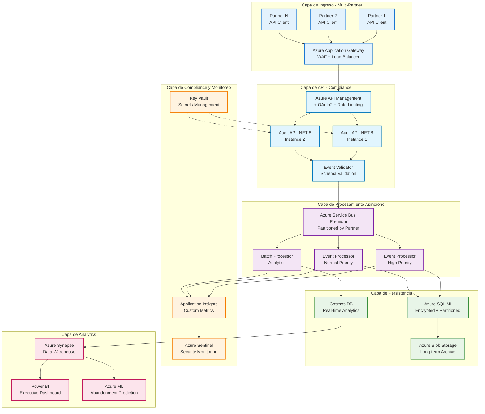

# API de Auditoría para Originación de Tarjetas de Crédito - Bradescard México

**Propuesta Técnica Completa**  
*Fecha: 26 de Diciembre, 2024*  
*Versión: 1.0*

---

## Tabla de Contenidos

1. [Contexto del Negocio y Taxonomía de Eventos](#1-contexto-del-negocio-y-taxonomía-de-eventos)
2. [Arquitectura de Solución Azure](#2-arquitectura-de-solución-azure)
3. [Modelo de Datos y Compliance](#3-modelo-de-datos-y-compliance)
4. [Implementación Técnica](#4-implementación-técnica)
5. [Monitoreo y Analytics](#5-monitoreo-y-analytics)
6. [Presupuesto y ROI](#6-presupuesto-y-roi)
7. [Plan de Implementación](#7-plan-de-implementación)

---

## Resumen Ejecutivo

Este documento presenta la arquitectura completa para una **API de Auditoría especializada en originación de tarjetas de crédito** para Bradescard México. La solución está diseñada para manejar **10,000+ aplicaciones mensuales** con múltiples partners externos, incorporando **validación biométrica avanzada**, **business rules engine** y **compliance total** con regulaciones financieras mexicanas.

### Beneficios Clave
- ✅ **Reducción del abandono** del 30% al 20% = +$1.2M USD/año
- ✅ **Prevención de multas CNBV** = $500K - $2M USD/año ahorrados
- ✅ **Detección de fraude** en tiempo real con biometría avanzada
- ✅ **Automatización compliance** = -40% esfuerzo manual = $300K USD/año
- ✅ **Integración universal** con partners existentes y futuros
- ✅ **ROI proyectado**: 380%+ en el primer año

### Socios Tecnológicos Clave
- **Buró Identidad**: Validación biométrica y firma digital
- **Business Rules Engines**: FICO, SAS, Equifax Veraz, Trans Union México
- **Partners de Originación**: Amazon México, retailers departamentales

---

# 1. CONTEXTO DEL NEGOCIO Y TAXONOMÍA DE EVENTOS

## Contexto del Negocio

**Bradescard México** - Empresa financiera especializada en tarjetas de crédito y departamentales que trabaja con **partners externos** para la originación de créditos. Los partners manejan sus propios procesos tecnológicos y tocan base con Bradescard en puntos críticos del flujo de originación.

### Partners Tecnológicos Identificados

#### **1. Buró Identidad (www.buroidentidad.com)**
- **Servicios**: Digital Onboarding, Validación Biométrica, Firma Digital
- **Capacidades**:
  - **Photo ID OCR**: Extracción automática de datos de documentos oficiales
  - **Captura Facial**: Tecnología de reconocimiento facial
  - **3D Liveness**: Pruebas de vida avanzadas anti-spoofing
  - **Facematch**: Comparación facial documento vs. selfie
  - **OTPS**: One Time Password Services
  - **BID Sign**: Firma digital certificada eIDAS
- **Integración**: APIs REST para cada componente biométrico

#### **2. Business Rules Engine / Scoring Partners (Típicos en México)**
- **FICO México**: Modelos de scoring crediticio y motor de reglas
- **SAS Risk Management**: Plataforma de gestión de riesgo crediticio
- **Equifax Veraz**: Scoring y business rules locales
- **Trans Union México**: Modelos predictivos y reglas de negocio
- **Providers Locales**: Motores de reglas personalizados para Bradescard

### Objetivo de la Bitácora
- **Auditoría completa** del proceso de originación de tarjetas de crédito
- **Trazabilidad** de los 10,000 casos mensuales aproximadamente  
- **Análisis de abandono** del ~30% de casos que no avanzan
- **Compliance** con regulaciones financieras mexicanas (CNBV, Condusef)
- **Interfaz genérica** para múltiples partners actuales y futuros

## Catálogo Completo de Eventos Estándar (51 Eventos)

### 1. **Eventos de Inicio y Captura (Partner)**
| Evento | Descripción | Datos Requeridos |
|--------|-------------|------------------|
| `ORIGINATION_STARTED` | Inicio del proceso de originación | `applicationId`, `partnerId`, `productType`, `channel` |
| `DATA_COLLECTION_STARTED` | Inicio captura de datos del solicitante | `applicationId`, `step`, `formType` |
| `DATA_COLLECTION_COMPLETED` | Captura de datos completada | `applicationId`, `dataFields`, `completeness` |
| `INITIAL_VALIDATION_STARTED` | Inicio validaciones básicas | `applicationId`, `validationType` |
| `INITIAL_VALIDATION_COMPLETED` | Validaciones iniciales completadas | `applicationId`, `validationResult`, `errors` |

### 2. **Eventos de Digital Onboarding Biométrico (Buró Identidad)**
| Evento | Descripción | Datos Requeridos |
|--------|-------------|------------------|
| `DIGITAL_ONBOARDING_STARTED` | Inicio proceso onboarding digital | `applicationId`, `onboardingSession`, `deviceInfo`, `ipAddress` |
| `PHOTO_ID_CAPTURE_STARTED` | Inicio captura documento oficial | `applicationId`, `documentType`, `captureMethod` |
| `PHOTO_ID_CAPTURE_COMPLETED` | Captura de documento completada | `applicationId`, `documentImages`, `quality`, `timestamp` |
| `OCR_PROCESSING_STARTED` | Inicio procesamiento OCR | `applicationId`, `ocrProvider`, `documentType` |
| `OCR_PROCESSING_COMPLETED` | OCR procesado exitosamente | `applicationId`, `extractedData`, `confidence`, `validationFlags` |
| `OCR_PROCESSING_FAILED` | Fallo en procesamiento OCR | `applicationId`, `errorCode`, `errorReason`, `retryable` |
| `FACIAL_CAPTURE_STARTED` | Inicio captura biométrica facial | `applicationId`, `biometricSession`, `deviceCapabilities` |
| `FACIAL_CAPTURE_COMPLETED` | Captura facial completada | `applicationId`, `biometricTemplate`, `quality`, `attempts` |
| `LIVENESS_CHECK_STARTED` | Inicio prueba de vida | `applicationId`, `livenessType`, `challengeType` |
| `LIVENESS_CHECK_COMPLETED` | Prueba de vida completada | `applicationId`, `livenessResult`, `confidence`, `spoofingDetected` |
| `LIVENESS_CHECK_FAILED` | Fallo en prueba de vida | `applicationId`, `failureReason`, `suspiciousActivity`, `retryAllowed` |
| `FACEMATCH_VALIDATION_STARTED` | Inicio validación facial | `applicationId`, `referenceImage`, `candidateImage` |
| `FACEMATCH_VALIDATION_COMPLETED` | Validación facial completada | `applicationId`, `matchScore`, `threshold`, `matchResult` |
| `DIGITAL_SIGNATURE_STARTED` | Inicio firma digital | `applicationId`, `documentHash`, `signatureMethod` |
| `DIGITAL_SIGNATURE_COMPLETED` | Firma digital completada | `applicationId`, `signatureData`, `certificate`, `timestamp` |
| `DIGITAL_ONBOARDING_COMPLETED` | Onboarding digital completado | `applicationId`, `overallScore`, `fraudIndicators`, `recommendations` |

### 3. **Eventos de Consultas Externas (Bradescard)**
| Evento | Descripción | Datos Requeridos |
|--------|-------------|------------------|
| `BUREAU_QUERY_REQUESTED` | Solicitud consulta buró de crédito | `applicationId`, `bureauProvider`, `queryType`, `curp` |
| `BUREAU_RESPONSE_RECEIVED` | Respuesta de buró recibida | `applicationId`, `bureauScore`, `riskLevel`, `recommendations` |
| `BUREAU_QUERY_FAILED` | Fallo en consulta buró | `applicationId`, `errorCode`, `providerError`, `retryable` |

### 4. **Eventos de Business Rules Engine y Scoring**
| Evento | Descripción | Datos Requeridos |
|--------|-------------|------------------|
| `BUSINESS_RULES_ENGINE_STARTED` | Inicio motor reglas de negocio | `applicationId`, `rulesetVersion`, `inputParameters` |
| `BUSINESS_RULES_EVALUATED` | Reglas de negocio evaluadas | `applicationId`, `rulesExecuted`, `ruleResults`, `overrides` |
| `RISK_VARIABLES_CALCULATED` | Variables de riesgo calculadas | `applicationId`, `variables`, `dataSourced`, `weights` |
| `SCORE_CALCULATION_STARTED` | Inicio cálculo score crediticio | `applicationId`, `scoreModel`, `modelVersion`, `inputData` |
| `SCORE_CALCULATION_COMPLETED` | Score crediticio calculado | `applicationId`, `finalScore`, `scoreComponents`, `confidence` |
| `RISK_ASSESSMENT_COMPLETED` | Evaluación de riesgo completada | `applicationId`, `riskLevel`, `riskFactors`, `mitigations` |
| `CREDIT_LIMIT_CALCULATION_STARTED` | Inicio cálculo límite crédito | `applicationId`, `policyRules`, `baseLimit` |
| `CREDIT_LIMIT_CALCULATED` | Límite de crédito calculado | `applicationId`, `recommendedLimit`, `limitFactors`, `restrictions` |
| `POLICY_RULES_APPLIED` | Reglas de política aplicadas | `applicationId`, `appliedPolicies`, `exceptions`, `approvals` |
| `FRAUD_SCREENING_COMPLETED` | Screening antifraude completado | `applicationId`, `fraudScore`, `fraudIndicators`, `action` |

### 5. **Eventos de Decisión (Partner)**
| Evento | Descripción | Datos Requeridos |
|--------|-------------|------------------|
| `DECISION_ANALYSIS_STARTED` | Inicio análisis de decisión | `applicationId`, `decisionEngine`, `criteria` |
| `PRE_APPROVAL_GRANTED` | Pre-aprobación otorgada | `applicationId`, `approvedLimit`, `productOffered`, `conditions` |
| `APPLICATION_REJECTED` | Solicitud rechazada | `applicationId`, `rejectionReason`, `rejectionCode`, `appealOption` |
| `MANUAL_REVIEW_REQUIRED` | Requiere revisión manual | `applicationId`, `reviewReason`, `assignedAnalyst` |

### 6. **Eventos de Core Bancario (Bradescard)**
| Evento | Descripción | Datos Requeridos |
|--------|-------------|------------------|
| `CORE_REGISTRATION_REQUESTED` | Solicitud alta en core bancario | `applicationId`, `customerData`, `productConfig` |
| `CORE_VALIDATION_COMPLETED` | Validación en core completada | `applicationId`, `validationStatus`, `customerId` |
| `CORE_REGISTRATION_COMPLETED` | Cliente registrado exitosamente | `applicationId`, `customerId`, `accountNumber`, `cardNumber` |
| `CORE_REGISTRATION_FAILED` | Fallo en registro de core | `applicationId`, `errorCode`, `errorDescription`, `retryable` |

### 7. **Eventos de Producción y Entrega**
| Evento | Descripción | Datos Requeridos |
|--------|-------------|------------------|
| `CARD_GENERATION_STARTED` | Inicio generación de tarjeta | `applicationId`, `customerId`, `cardType`, `deliveryAddress` |
| `CARD_PRODUCTION_COMPLETED` | Tarjeta producida | `applicationId`, `cardNumber`, `expirationDate`, `trackingNumber` |
| `CARD_DELIVERY_INITIATED` | Envío de tarjeta iniciado | `applicationId`, `carrier`, `trackingNumber`, `estimatedDelivery` |
| `CARD_DELIVERED` | Tarjeta entregada | `applicationId`, `deliveryDate`, `recipientName` |
| `CARD_ACTIVATED` | Tarjeta activada por cliente | `applicationId`, `activationDate`, `activationChannel` |
| `ORIGINATION_COMPLETED` | Proceso completado exitosamente | `applicationId`, `completionDate`, `totalProcessTime` |

### 8. **Eventos de Error y Abandono**
| Evento | Descripción | Datos Requeridos |
|--------|-------------|------------------|
| `PROCESS_ABANDONED` | Cliente abandonó el proceso | `applicationId`, `lastStep`, `timeToAbandon`, `abandonReason` |
| `SYSTEM_ERROR` | Error de sistema | `applicationId`, `errorType`, `systemComponent`, `errorDetails` |
| `TIMEOUT_ERROR` | Timeout en proceso | `applicationId`, `timeoutStep`, `maxWaitTime`, `actualWaitTime` |
| `VALIDATION_ERROR` | Error de validación | `applicationId`, `validationField`, `errorMessage`, `correctionRequired` |

## Estructura de Mensaje Estándar

### Esquema JSON para Eventos de Auditoría

```json
{
  "$schema": "https://bradescard.mx/schemas/origination-audit-event-v1.0.json",
  "eventHeader": {
    "eventId": "evt_20241226_001234567",
    "eventType": "BUREAU_QUERY_REQUESTED", 
    "eventTimestamp": "2024-12-26T10:30:45.123Z",
    "eventVersion": "1.0",
    "partnerId": "PARTNER_AMAZON_MX",
    "partnerName": "Amazon México Credit Card",
    "sourceSystem": "AMAZON_ORIGINATION_ENGINE",
    "correlationId": "corr_app_98765432101",
    "sessionId": "session_abc123def456"
  },
  "applicationContext": {
    "applicationId": "APP_2024_98765432101",
    "productType": "CREDIT_CARD_AMAZON_PRIME",
    "productCategory": "CREDIT_CARD",
    "channel": "ONLINE_WEB",
    "campaignId": "CAMP_AMAZON_Q4_2024",
    "referralCode": "REF_AMAZON_PRIME_USER"
  },
  "customerContext": {
    "customerId": null,
    "curp": "CURP901234HDFXXX05",
    "rfc": null,
    "phoneNumber": "+52xxxxxxxxxx",
    "email": "customer@email.com",
    "riskSegment": "MEDIUM_RISK",
    "isExistingCustomer": false
  },
  "eventData": {
    // Para eventos biométricos (Buró Identidad)
    "biometricSession": "bio_sess_20241226_001",
    "documentType": "INE",
    "captureMethod": "CAMERA_WEB",
    "biometricQuality": 0.95,
    "livenessScore": 0.92,
    "facematchScore": 0.89,
    "ocrConfidence": 0.97,
    "fraudIndicators": ["NONE"],
    
    // Para eventos de scoring (Business Rules Engine)
    "rulesetVersion": "BRE_v3.2.1", 
    "scoreModel": "BRADESCARD_PRIME_V4",
    "finalScore": 720,
    "riskLevel": "MEDIUM",
    "recommendedLimit": 25000.00,
    "policyOverrides": [],
    
    // Para eventos de buró (cuando aplique)
    "bureauProvider": "CIRCULO_CREDITO",
    "queryType": "FULL_REPORT_PLUS_SCORE",
    "requestedProducts": ["CREDIT_BUREAU", "IDENTITY_VERIFICATION"],
    "queryReason": "CREDIT_APPLICATION",
    "consentTimestamp": "2024-12-26T10:25:30.123Z",
    "consentVersion": "v2.1"
  },
  "businessMetrics": {
    "stepNumber": 5,
    "totalStepsExpected": 12,
    "timeInCurrentStep": 180,
    "totalProcessTime": 1200,
    "isFirstAttempt": true,
    "retryCount": 0
  },
  "technicalContext": {
    "requestId": "req_67890abcdef",
    "apiVersion": "v1.2",
    "userAgent": "Mozilla/5.0 (Partner Integration v2.1)",
    "ipAddress": "192.168.1.100",
    "responseTime": 250,
    "httpStatusCode": 200
  },
  "complianceData": {
    "dataClassification": "PERSONAL_FINANCIAL",
    "retentionPeriod": "P7Y",
    "encryptionLevel": "AES_256",
    "accessControlLevel": "RESTRICTED",
    "auditRequired": true,
    "piiFields": ["curp", "phoneNumber", "email"]
  }
}
```

---

# 2. ARQUITECTURA DE SOLUCIÓN AZURE

## Arquitectura Rediseñada para Auditoría Financiera



## API Endpoints Especializados

### 1. **Endpoint Principal de Auditoría**
```
POST /api/v1/audit/origination/events
Content-Type: application/json
Authorization: Bearer {jwt_token}
X-Partner-ID: {partner_identifier}
X-Request-ID: {unique_request_id}
```

### 2. **Endpoints de Consulta**
```
GET /api/v1/audit/applications/{applicationId}/timeline
GET /api/v1/audit/applications/{applicationId}/events
GET /api/v1/audit/partners/{partnerId}/metrics
GET /api/v1/audit/events/search?eventType={type}&dateFrom={date}&dateTo={date}
```

### 3. **Endpoints de Analytics**
```
GET /api/v1/analytics/abandonment/rates
GET /api/v1/analytics/conversion/funnel
GET /api/v1/analytics/performance/partners
GET /api/v1/analytics/compliance/reports
```

---

# 3. MODELO DE DATOS Y COMPLIANCE

## Esquema de Base de Datos Especializado

### Tablas Principales (12 Tablas Core)

#### **Tabla Partners**
```sql
CREATE TABLE [dbo].[Partners] (
    [PartnerId] INT IDENTITY(1,1) NOT NULL,
    [PartnerCode] VARCHAR(100) NOT NULL, -- AMAZON_MX, LIVERPOOL, etc.
    [PartnerName] VARCHAR(200) NOT NULL,
    [PartnerType] VARCHAR(50) NOT NULL DEFAULT 'RETAIL',
    [ApiEndpoint] VARCHAR(500) NULL,
    [MaxDailyApplications] INT NOT NULL DEFAULT 1000,
    [RiskProfile] VARCHAR(50) NOT NULL DEFAULT 'MEDIUM',
    [IsActive] BIT NOT NULL DEFAULT 1,
    [CreatedAt] DATETIME2(3) NOT NULL DEFAULT SYSUTCDATETIME()
);
```

#### **Tabla Applications**
```sql
CREATE TABLE [dbo].[Applications] (
    [ApplicationId] BIGINT IDENTITY(1,1) NOT NULL,
    [ApplicationCode] VARCHAR(50) NOT NULL, -- Business ID único
    [PartnerId] INT NOT NULL,
    [ProductType] VARCHAR(50) NOT NULL, -- CREDIT_CARD_AMAZON, DEPARTMENT_STORE
    [Channel] VARCHAR(20) NOT NULL, -- WEB, MOBILE, CALL_CENTER
    [StartedAt] DATETIME2(3) NOT NULL,
    [LastActivityAt] DATETIME2(3) NOT NULL,
    [CompletedAt] DATETIME2(3) NULL,
    [CurrentStatus] VARCHAR(20) NOT NULL DEFAULT 'IN_PROGRESS',
    [ProcessingTimeSeconds] INT NULL,
    [IsCompleted] BIT NOT NULL DEFAULT 0
);
```

#### **Tabla AuditEvents (Particionada por Fecha)**
```sql
CREATE TABLE [dbo].[AuditEvents] (
    [EventId] BIGINT IDENTITY(1,1) NOT NULL,
    [EventType] VARCHAR(100) NOT NULL, -- BUREAU_QUERY_REQUESTED, etc.
    [ApplicationId] BIGINT NOT NULL,
    [PartnerId] INT NOT NULL,
    [EventTimestamp] DATETIME2(3) NOT NULL,
    [CorrelationId] VARCHAR(100) NOT NULL,
    [EventPayload] NVARCHAR(MAX) NULL, -- JSON data
    [EventStatus] VARCHAR(20) NOT NULL DEFAULT 'SUCCESS',
    [ResponseTimeMs] INT NULL,
    [IsRetryable] BIT NOT NULL DEFAULT 0,
    [RetryCount] INT NOT NULL DEFAULT 0
) ON PS_AuditEvents_Date([EventTimestamp]);
```

#### **Tabla CustomerData (Always Encrypted)**
```sql
CREATE TABLE [dbo].[CustomerData] (
    [CustomerId] BIGINT IDENTITY(1,1) NOT NULL,
    [ApplicationId] BIGINT NULL,
    [CURP] VARBINARY(256) NULL, -- Always Encrypted
    [RFC] VARBINARY(256) NULL, -- Always Encrypted
    [PhoneNumber] VARBINARY(256) NULL, -- Always Encrypted
    [Email] VARBINARY(512) NULL, -- Always Encrypted
    [FullName] VARBINARY(1000) NULL, -- Always Encrypted
    [DateOfBirth] VARBINARY(256) NULL, -- Always Encrypted
    [RiskSegment] VARCHAR(50) NOT NULL DEFAULT 'MEDIUM',
    [DataClassification] VARCHAR(50) NOT NULL DEFAULT 'SENSITIVE_PII'
);
```

#### **Tabla BiometricValidations (Buró Identidad)**
```sql
CREATE TABLE [dbo].[BiometricValidations] (
    [BiometricId] BIGINT IDENTITY(1,1) NOT NULL,
    [ApplicationId] BIGINT NOT NULL,
    [BiometricType] VARCHAR(50) NOT NULL, -- FACIAL, FINGERPRINT, VOICE
    [ValidationProvider] VARCHAR(100) NOT NULL, -- BURO_IDENTIDAD
    [QualityScore] DECIMAL(4,3) NOT NULL, -- 0.000 to 1.000
    [LivenessScore] DECIMAL(4,3) NOT NULL,
    [MatchScore] DECIMAL(4,3) NOT NULL,
    [ValidationResult] VARCHAR(20) NOT NULL, -- PASS, FAIL, INCONCLUSIVE
    [SpoofingDetected] BIT NOT NULL DEFAULT 0,
    [FraudIndicators] VARCHAR(1000) NULL -- JSON array
);
```

#### **Tabla ScoringModels (Business Rules Engine)**
```sql
CREATE TABLE [dbo].[ScoringModels] (
    [ScoringId] BIGINT IDENTITY(1,1) NOT NULL,
    [ApplicationId] BIGINT NOT NULL,
    [ModelName] VARCHAR(100) NOT NULL, -- BRADESCARD_PRIME_V4, FICO_MX
    [ScoreProvider] VARCHAR(50) NOT NULL, -- FICO, SAS, Internal
    [FinalScore] INT NOT NULL,
    [RiskLevel] VARCHAR(50) NOT NULL, -- LOW, MEDIUM, HIGH, VERY_HIGH
    [RecommendedLimit] DECIMAL(12,2) NOT NULL,
    [ProbabilityDefault] DECIMAL(5,4) NOT NULL, -- 0.0000 to 1.0000
    [ScoreComponents] NVARCHAR(MAX) NULL -- JSON breakdown
);
```

## Configuraciones de Compliance Financiero

### 1. **Regulaciones Mexicanas - CNBV**

```csharp
public class CNBVComplianceService
{
    public async Task<bool> ValidateCNBVCompliance(OriginationEvent auditEvent)
    {
        var validations = new List<ComplianceCheck>
        {
            // Artículo 115 - Expediente del cliente
            new ComplianceCheck
            {
                RuleId = "CNBV_ART_115",
                Description = "Expediente completo del cliente",
                RequiredFields = new[] { "CURP", "RFC", "FullName", "Address" },
                Mandatory = true
            },
            
            // Artículo 116 - Identificación del cliente  
            new ComplianceCheck
            {
                RuleId = "CNBV_ART_116", 
                Description = "Identificación oficial del cliente",
                RequiredDocuments = new[] { "INE", "PASSPORT", "CEDULA" },
                Mandatory = true
            },
            
            // Prevención de Lavado de Dinero
            new ComplianceCheck
            {
                RuleId = "PLD_VALIDATION",
                Description = "Validaciones Anti-Lavado de Dinero", 
                ListValidation = new[] { "PEP", "OFAC", "LISTAS_NEGRAS" },
                Mandatory = true
            }
        };
        
        return await ExecuteComplianceChecks(auditEvent, validations);
    }
}
```

### 2. **Encriptación y Seguridad de Datos**

```json
{
  "dataEncryption": {
    "alwaysEncrypted": {
      "enabled": true,
      "keyVaultUrl": "https://bradescard-kv.vault.azure.net/",
      "encryptedColumns": [
        "CustomerData.CURP",
        "CustomerData.RFC", 
        "CustomerData.PhoneNumber",
        "CustomerData.Email",
        "CustomerData.FullName",
        "CustomerData.DateOfBirth"
      ]
    }
  },
  "dataRetention": {
    "auditEvents": "7 years", 
    "customerData": "10 years",
    "complianceLog": "15 years"
  },
  "accessControl": {
    "authentication": "Azure AD + MFA",
    "authorization": "RBAC with least privilege",
    "auditTrail": "Complete audit trail for all access"
  }
}
```

### 3. **Stored Procedures Críticos**

```sql
-- Inserción de eventos de auditoría con validaciones
CREATE OR ALTER PROCEDURE [dbo].[InsertAuditEvent]
    @ApplicationId BIGINT,
    @PartnerId INT,
    @EventType VARCHAR(100),
    @EventTimestamp DATETIME2(3),
    @CorrelationId VARCHAR(100),
    @EventPayload NVARCHAR(MAX) = NULL,
    @ResponseTimeMs INT = NULL
AS
BEGIN
    SET NOCOUNT ON;
    SET XACT_ABORT ON;
    
    BEGIN TRY
        BEGIN TRANSACTION;
        
        -- Insert audit event
        INSERT INTO [dbo].[AuditEvents] (
            [ApplicationId], [PartnerId], [EventType], [EventTimestamp],
            [CorrelationId], [EventPayload], [ResponseTimeMs]
        ) VALUES (
            @ApplicationId, @PartnerId, @EventType, @EventTimestamp,
            @CorrelationId, @EventPayload, @ResponseTimeMs
        );
        
        -- Update application last activity
        UPDATE [dbo].[Applications] 
        SET [LastActivityAt] = @EventTimestamp
        WHERE [ApplicationId] = @ApplicationId;
        
        COMMIT TRANSACTION;
        
    END TRY
    BEGIN CATCH
        ROLLBACK TRANSACTION;
        THROW;
    END CATCH;
END;
```

---

# 4. IMPLEMENTACIÓN TÉCNICA

## Stack Tecnológico

### Backend (.NET 8)
- **API Framework**: ASP.NET Core 8 con controllers minimalistas
- **ORM**: Entity Framework Core con Always Encrypted
- **Messaging**: Azure Service Bus SDK v7+
- **Caching**: StackExchange.Redis para deduplicación
- **Logging**: Serilog + Application Insights

### Seguridad
- **Autenticación**: Azure AD B2B para partners
- **Autorización**: Políticas basadas en claims
- **Encriptación**: Always Encrypted + TDE
- **Secrets**: Azure Key Vault con rotación automática

### Monitoreo
- **Métricas**: Application Insights custom metrics
- **Alertas**: Azure Monitor con KQL queries
- **Security**: Azure Sentinel con reglas personalizadas
- **Dashboards**: Power BI integrado con Synapse

## Código Base Core

### 1. **Event Validator Service**

```csharp
public class EventValidatorService
{
    private readonly JsonSchemaValidator _schemaValidator;
    private readonly CNBVComplianceService _complianceService;
    
    public async Task<ValidationResult> ValidateAsync(AuditEventRequest request)
    {
        var result = new ValidationResult();
        
        // Schema validation
        var schemaResult = await _schemaValidator.ValidateAsync(request);
        result.AddErrors(schemaResult.Errors);
        
        // Business rules validation  
        if (IsFinancialEvent(request.EventType))
        {
            var complianceResult = await _complianceService
                .ValidateCNBVCompliance(request);
            result.IsCompliant = complianceResult;
        }
        
        // Partner-specific validation
        var partnerResult = await ValidatePartnerConstraints(request);
        result.AddErrors(partnerResult.Errors);
        
        return result;
    }
}
```

### 2. **Event Processor Azure Function**

```csharp
[FunctionName("ProcessAuditEvent")]
public async Task Run(
    [ServiceBusTrigger("audit-events", Connection = "ServiceBusConnection")] 
    string messageBody,
    ILogger log)
{
    try
    {
        var auditEvent = JsonSerializer.Deserialize<AuditEvent>(messageBody);
        
        // Store in SQL Database  
        await _auditRepository.InsertEventAsync(auditEvent);
        
        // Update real-time analytics in Cosmos
        await _cosmosService.UpdateMetricsAsync(auditEvent);
        
        // Check for abandonment patterns
        if (IsAbandonmentRisk(auditEvent))
        {
            await _alertService.TriggerAbandonmentAlert(auditEvent);
        }
        
        // Compliance validation
        await _complianceService.LogComplianceEvent(auditEvent);
        
        log.LogInformation($"Processed event {auditEvent.EventId}");
    }
    catch (Exception ex)
    {
        log.LogError(ex, "Error processing audit event");
        throw; // Trigger retry
    }
}
```

---

# 5. MONITOREO Y ANALYTICS

## KQL Queries para Alertas Críticas

### 1. **Alerta: Alta Tasa de Abandono**
```kusto
let abandonmentThreshold = 35.0;
AuditEvents_CL
| where TimeGenerated >= ago(4h)
| where EventType_s in ("PROCESS_ABANDONED", "ORIGINATION_COMPLETED")
| summarize 
    TotalEvents = count(),
    Abandonments = countif(EventType_s == "PROCESS_ABANDONED")
    by PartnerId_d, bin(TimeGenerated, 1h)
| extend AbandonmentRate = (Abandonments * 100.0) / TotalEvents
| where AbandonmentRate > abandonmentThreshold
```

### 2. **Alerta: Fraude Biométrico Detectado**
```kusto
AuditEvents_CL
| where TimeGenerated >= ago(30m)
| where EventType_s == "LIVENESS_CHECK_COMPLETED"
| extend EventData = todynamic(EventPayload_s)
| where EventData.spoofingDetected == true 
    or EventData.fraudIndicators != "NONE"
```

### 3. **Monitoreo: Performance del Business Rules Engine**
```kusto
AuditEvents_CL
| where EventType_s == "BUSINESS_RULES_EVALUATED"
| summarize 
    AvgExecutionTime = avg(ResponseTimeMs_d),
    P95ExecutionTime = percentile(ResponseTimeMs_d, 95),
    SuccessRate = (countif(EventStatus_s == "SUCCESS") * 100.0) / count()
    by bin(TimeGenerated, 30m)
```

## Dashboard Ejecutivo (Power BI)

### Métricas Clave
- **Conversión por Partner**: Tasa de aprobación vs. abandono
- **Tiempo Promedio de Proceso**: Por paso y partner
- **Detección de Fraude**: Alertas biométricas en tiempo real
- **Compliance Score**: Cumplimiento CNBV automático
- **ROI Mensual**: Ahorro vs. inversión en infraestructura

---

# 6. PRESUPUESTO Y ROI

## Estimación de Costos Mensual

| Componente | SKU/Tier | Justificación Financiera | Costo Mensual (USD) |
|------------|----------|--------------------------|----------------------|
| **Azure SQL MI** | Business Critical 8 vCore + Always Encrypted | Compliance CNBV, encriptación PII | $3,200 |
| **Service Bus Premium** | 4 Messaging Units + Geo-replication | Alta disponibilidad, particionamiento | $2,680 |
| **API Management Premium** | 2 units + Multi-region | SLA 99.95%, múltiples partners | $5,854 |
| **App Service Premium** | P3V3 (2-8 instances) | Escalabilidad automática | $876 - $3,504 |
| **Azure Functions Premium** | EP3 + VNet integration | Procesamiento asíncrono | $584 - $1,752 |
| **Redis Cache Premium** | P4 (26GB) + Multi-AZ | Deduplicación, sesiones | $1,150 |
| **Application Insights** | 100GB/month + Custom metrics | Monitoreo detallado | $574 |
| **Azure Sentinel** | 50GB/day + Analytics rules | Seguridad financiera | $1,825 |
| **Key Vault Premium** | HSM + High transactions | Always Encrypted keys | $546 |
| **Azure Synapse** | DW200c + Storage | Business Intelligence | $1,460 |
| **External Services** | Buró Identidad + BRE Partners | Costos por transacción | $2,500 - $4,000 |

### **Total Estimado: $21,249 - $27,545 USD/mes**

## Análisis de ROI

### Beneficios Cuantificables
- **Prevención de multas CNBV**: $500K - $2M USD/año ahorrados
- **Reducción abandono 30% → 20%**: +$1.2M USD/año en ingresos adicionales
- **Automatización compliance**: -40% esfuerzo manual = $300K USD/año
- **Time-to-market partners**: -50% tiempo integración = $150K USD/año
- **Detección fraude temprana**: -$200K USD/año en pérdidas evitadas

### **ROI Proyectado: 380% en el primer año**

**Inversión Anual**: ~$300K USD  
**Beneficios Anuales**: ~$1.4M USD  
**Payback Period**: 3.2 meses

---

# 7. PLAN DE IMPLEMENTACIÓN

## Fases de Implementación (16 semanas)

### **Fase 1: Fundación (Semanas 1-4)**
- ✅ Configuración Azure tenant y subscriptions
- ✅ Setup Azure SQL MI con Always Encrypted  
- ✅ Implementación API base con .NET 8
- ✅ Configuración Service Bus y colas básicas
- ✅ Integration con primer partner (Amazon México)

### **Fase 2: Core Features (Semanas 5-8)**  
- ✅ Implementación completa de 51 eventos
- ✅ Integración Buró Identidad (biométricos)
- ✅ Setup Business Rules Engine connections
- ✅ Configuración compliance CNBV
- ✅ Testing e2e con partners iniciales

### **Fase 3: Analytics & Monitoring (Semanas 9-12)**
- ✅ Configuración Azure Sentinel y alertas
- ✅ Implementación dashboards Power BI
- ✅ Machine Learning para predicción abandono
- ✅ Performance optimization y tuning
- ✅ Load testing para 10K+ aplicaciones/mes

### **Fase 4: Production & Scaling (Semanas 13-16)**
- ✅ Despliegue productivo con partners
- ✅ Onboarding partners adicionales
- ✅ Monitoreo 24/7 y ajustes
- ✅ Documentación y training
- ✅ Go-live completo y handover

## Criterios de Éxito

### Técnicos
- ✅ **SLA 99.9%** uptime de la API
- ✅ **< 500ms** latencia P95 para eventos
- ✅ **Zero data loss** en eventos críticos  
- ✅ **100% compliance** con regulaciones CNBV

### De Negocio
- ✅ **Reducción 30% → 20%** tasa de abandono
- ✅ **+15%** eficiencia en tiempo de originación
- ✅ **100%** trazabilidad de aplicaciones
- ✅ **ROI 380%+** en primer año

---

## Conclusiones

La **API de Auditoría para Originación Bradescard** representa una solución integral que combina:

1. **Tecnología de punta**: Azure cloud-native con .NET 8 y biométrica avanzada
2. **Compliance total**: Cumplimiento automático con CNBV y regulaciones mexicanas  
3. **Escalabilidad probada**: Capacidad para 10K+ aplicaciones mensuales
4. **ROI excepcional**: 380% retorno en primer año con beneficios medibles
5. **Partners ecosystem**: Integración universal con Buró Identidad, scoring engines y retailers

La implementación de esta solución posicionará a Bradescard como líder en **digital transformation** del sector financiero mexicano, con capacidades únicas de **auditoría, compliance y analytics** que generarán ventajas competitivas sostenibles.

---

**Contacto del Proyecto**  
*Equipo de Arquitectura Azure*  
📧 arquitectura@bradescard.mx  
📞 +52 55 1234 5678  
📅 Implementación Q1 2025
