# Modelo de Datos y Compliance - API Auditoría Originación Bradescard

## Esquema de Base de Datos Especializado

### Modelo Conceptual para Auditoría de Originación

```mermaid
erDiagram
    PARTNERS {
        int PartnerId PK "Identity"
        varchar_100 PartnerCode "Unique, e.g., AMAZON_MX"
        varchar_200 PartnerName
        varchar_50 PartnerType "RETAIL, BANK, FINTECH"
        varchar_100 ContactEmail
        varchar_20 ContactPhone
        bit IsActive
        datetime2 CreatedAt
        datetime2 UpdatedAt
        varchar_500 ApiEndpoint
        varchar_100 AuthenticationMethod
        int MaxDailyApplications
        varchar_50 RiskProfile "LOW, MEDIUM, HIGH"
    }
    
    APPLICATIONS {
        bigint ApplicationId PK "Identity"
        varchar_50 ApplicationCode "Unique business ID"
        int PartnerId FK
        varchar_50 ProductType "CREDIT_CARD_AMAZON, DEPARTMENT_STORE"
        varchar_20 Channel "WEB, MOBILE, CALL_CENTER"
        varchar_50 CampaignId
        varchar_50 ReferralCode
        datetime2 StartedAt
        datetime2 LastActivityAt
        datetime2 CompletedAt
        varchar_20 CurrentStatus "IN_PROGRESS, APPROVED, REJECTED, ABANDONED"
        varchar_50 CurrentStep
        int TotalSteps
        int ProcessingTimeSeconds
        bit IsCompleted
        varchar_1000 Notes
        datetime2 CreatedAt
        varchar_50 CreatedBy
    }
    
    AUDIT_EVENTS {
        bigint EventId PK "Identity, Clustered"
        varchar_50 EventCode "Business event identifier"
        varchar_100 EventType "BUREAU_QUERY_REQUESTED, etc"
        bigint ApplicationId FK
        int PartnerId FK
        datetime2 EventTimestamp "Indexed"
        varchar_50 EventVersion
        varchar_100 CorrelationId "For tracking across systems"
        varchar_100 SessionId
        varchar_50 SourceSystem
        nvarchar_max EventPayload "JSON event data"
        varchar_20 EventStatus "SUCCESS, FAILED, PENDING"
        varchar_1000 ErrorMessage
        int ResponseTimeMs
        varchar_20 HttpStatusCode
        datetime2 ProcessedAt
        bit IsRetryable
        int RetryCount
        varchar_50 ProcessedBy "System or user"
    }
    
    CUSTOMER_DATA {
        bigint CustomerId PK "Identity"
        bigint ApplicationId FK "Can be null for existing customers"
        varchar_18 CURP "Encrypted, Mexican ID"
        varchar_13 RFC "Encrypted, Tax ID"
        varchar_20 PhoneNumber "Encrypted"
        varchar_200 Email "Encrypted"
        varchar_500 FullName "Encrypted"
        date DateOfBirth "Encrypted"
        varchar_20 Gender
        varchar_50 Nationality
        varchar_1000 Address "Encrypted JSON"
        varchar_50 RiskSegment "LOW, MEDIUM, HIGH, VIP"
        bit IsExistingCustomer
        datetime2 FirstApplicationDate
        int TotalApplicationsCount
        decimal_10_2 HighestApprovedLimit
        varchar_20 CustomerStatus "ACTIVE, INACTIVE, BLOCKED"
        datetime2 CreatedAt
        datetime2 UpdatedAt
        varchar_50 DataClassification "PII, SENSITIVE_PII, FINANCIAL"
    }
    
    BUREAU_QUERIES {
        bigint QueryId PK "Identity"
        bigint ApplicationId FK
        varchar_50 BureauProvider "CIRCULO_CREDITO, TRANS_UNION"
        varchar_50 QueryType "FULL_REPORT, SCORE_ONLY, IDENTITY_VERIFY"
        datetime2 RequestedAt
        datetime2 ResponseReceivedAt
        int ResponseTimeMs
        varchar_20 QueryStatus "SUCCESS, FAILED, TIMEOUT"
        int BureauScore
        varchar_50 RiskLevel "LOW, MEDIUM, HIGH, VERY_HIGH"
        nvarchar_max BureauResponse "Encrypted JSON response"
        decimal_8_2 QueryCost "Cost of the query"
        varchar_100 QueryReference "Bureau reference number"
        varchar_1000 ErrorDescription
        datetime2 CreatedAt
    }
    
    SCORE_CALCULATIONS {
        bigint ScoreId PK "Identity"
        bigint ApplicationId FK
        varchar_50 ScoreModel "BRADESCARD_V1, PARTNER_SPECIFIC"
        datetime2 CalculatedAt
        int InternalScore
        varchar_50 RiskSegment
        decimal_12_2 RecommendedLimit
        decimal_5_4 ProbabilityDefault "0.0 to 1.0"
        decimal_5_4 ProbabilityApproval "0.0 to 1.0"
        nvarchar_max InputVariables "JSON with variables used"
        nvarchar_max ModelOutput "JSON with detailed results"
        varchar_50 ModelVersion
        varchar_20 CalculationStatus "SUCCESS, FAILED"
        varchar_1000 ErrorMessage
        datetime2 CreatedAt
    }
    
    APPROVALS_REJECTIONS {
        bigint DecisionId PK "Identity"
        bigint ApplicationId FK
        varchar_20 DecisionType "APPROVAL, REJECTION, MANUAL_REVIEW"
        datetime2 DecisionAt
        varchar_50 DecisionEngine "AUTO, MANUAL, HYBRID"
        varchar_100 DecisionReason
        varchar_20 RejectionCode
        decimal_12_2 ApprovedLimit
        varchar_100 ProductOffered
        nvarchar_max Conditions "JSON with approval conditions"
        varchar_100 DecisionMaker "System or analyst ID"
        bit AppealAvailable
        datetime2 AppealDeadline
        varchar_1000 Comments
        datetime2 CreatedAt
    }
    
    COMPLIANCE_LOG {
        bigint ComplianceId PK "Identity"
        bigint ApplicationId FK
        varchar_50 ComplianceType "CNBV, CONDUSEF, PRIVACY"
        varchar_100 RegulationReference
        varchar_20 ComplianceStatus "COMPLIANT, NON_COMPLIANT, PENDING"
        datetime2 CheckedAt
        varchar_1000 ComplianceDetails
        varchar_500 RequiredActions
        datetime2 DueDate
        varchar_50 ResponsibleArea
        bit IsResolved
        datetime2 ResolvedAt
        varchar_1000 Resolution
        datetime2 CreatedAt
    }
    
    EVENT_METADATA {
        bigint MetadataId PK "Identity"
        bigint EventId FK
        varchar_100 MetadataKey
        nvarchar_max MetadataValue "JSON or plain text"
        varchar_50 DataType "STRING, NUMBER, JSON, ENCRYPTED"
        bit IsSensitive
        varchar_50 EncryptionMethod
        datetime2 CreatedAt
    }
    
    BIOMETRIC_VALIDATIONS {
        bigint BiometricId PK "Identity"
        bigint ApplicationId FK
        varchar_50 BiometricType "FACIAL, FINGERPRINT, VOICE, IRIS"
        varchar_100 BiometricSession "Session identifier"
        varchar_50 ValidationProvider "BURO_IDENTIDAD, etc."
        datetime2 CaptureTimestamp
        decimal_4_3 QualityScore "0.000 to 1.000"
        decimal_4_3 LivenessScore "0.000 to 1.000"  
        decimal_4_3 MatchScore "0.000 to 1.000"
        varchar_20 ValidationResult "PASS, FAIL, INCONCLUSIVE"
        nvarchar_max BiometricTemplate "Encrypted biometric data"
        varchar_1000 FraudIndicators "JSON array of indicators"
        varchar_50 DeviceInfo "Capture device information"
        varchar_45 IPAddress "Client IP address"
        bit SpoofingDetected
        int AttemptsCount
        varchar_1000 ErrorDetails
        datetime2 CreatedAt
    }
    
    DOCUMENT_VALIDATIONS {
        bigint DocumentId PK "Identity"
        bigint ApplicationId FK
        varchar_50 DocumentType "INE, PASSPORT, CEDULA, RFC"
        varchar_100 DocumentProvider "BURO_IDENTIDAD, etc."
        datetime2 CaptureTimestamp
        nvarchar_max DocumentImages "Encrypted JSON with image data"
        nvarchar_max OCRResults "Encrypted extracted data"
        decimal_4_3 OCRConfidence "0.000 to 1.000"
        varchar_20 ValidationResult "VALID, INVALID, SUSPICIOUS"
        nvarchar_max ExtractedData "Encrypted personal data"
        varchar_1000 ValidationFlags "JSON array of validation results"
        varchar_1000 QualityMetrics "JSON with image quality data"
        bit DocumentAuthenticity
        varchar_1000 FraudIndicators "Detected fraud patterns"
        varchar_1000 ErrorDetails
        datetime2 CreatedAt
    }
    
    BUSINESS_RULES_EXECUTION {
        bigint RuleExecutionId PK "Identity"
        bigint ApplicationId FK
        varchar_100 RulesetVersion "BRE version identifier"
        varchar_50 RuleEngine "Provider name"
        datetime2 ExecutionStarted
        datetime2 ExecutionCompleted
        int TotalRulesEvaluated
        int RulesPassed
        int RulesFailed
        nvarchar_max InputParameters "JSON with input data"
        nvarchar_max RuleResults "JSON with detailed results"
        nvarchar_max PolicyOverrides "JSON with override information"
        varchar_20 ExecutionStatus "SUCCESS, FAILED, PARTIAL"
        varchar_1000 ErrorDetails
        varchar_50 ExecutedBy "System or user ID"
        datetime2 CreatedAt
    }
    
    SCORING_MODELS {
        bigint ScoringId PK "Identity"
        bigint ApplicationId FK
        varchar_100 ModelName "BRADESCARD_PRIME_V4, etc."
        varchar_50 ModelVersion
        varchar_50 ScoreProvider "Internal, FICO, Fair Isaac"
        datetime2 CalculationTimestamp
        int FinalScore
        varchar_50 RiskLevel "LOW, MEDIUM, HIGH, VERY_HIGH"
        decimal_12_2 RecommendedLimit
        decimal_5_4 ProbabilityDefault "0.0000 to 1.0000"
        decimal_5_4 ProbabilityApproval "0.0000 to 1.0000"
        nvarchar_max ScoreComponents "JSON with score breakdown"
        nvarchar_max RiskFactors "JSON with risk variables"
        nvarchar_max InputVariables "JSON with model inputs"
        varchar_20 CalculationStatus "SUCCESS, FAILED"
        varchar_1000 ErrorDetails
        datetime2 CreatedAt
    }
    
    %% Relationships
    PARTNERS ||--o{ APPLICATIONS : "has"
    APPLICATIONS ||--o{ AUDIT_EVENTS : "generates"
    PARTNERS ||--o{ AUDIT_EVENTS : "originates"
    APPLICATIONS ||--o| CUSTOMER_DATA : "belongs_to"
    APPLICATIONS ||--o{ BUREAU_QUERIES : "requests"
    APPLICATIONS ||--o{ SCORE_CALCULATIONS : "calculates"
    APPLICATIONS ||--o{ APPROVALS_REJECTIONS : "decides"
    APPLICATIONS ||--o{ COMPLIANCE_LOG : "complies_with"
    AUDIT_EVENTS ||--o{ EVENT_METADATA : "contains"
    APPLICATIONS ||--o{ BIOMETRIC_VALIDATIONS : "validates"
    APPLICATIONS ||--o{ DOCUMENT_VALIDATIONS : "processes"
    APPLICATIONS ||--o{ BUSINESS_RULES_EXECUTION : "executes"
    APPLICATIONS ||--o{ SCORING_MODELS : "scores"
```



## Scripts SQL de Implementación

### 1. Tablas Principales con Particionamiento

```sql
-- =====================================================
-- Partition Functions para eventos por fecha
-- =====================================================
CREATE PARTITION FUNCTION PF_AuditEvents_Date (datetime2)
AS RANGE RIGHT FOR VALUES (
    '2024-01-01', '2024-02-01', '2024-03-01', '2024-04-01',
    '2024-05-01', '2024-06-01', '2024-07-01', '2024-08-01',
    '2024-09-01', '2024-10-01', '2024-11-01', '2024-12-01'
);

CREATE PARTITION SCHEME PS_AuditEvents_Date 
AS PARTITION PF_AuditEvents_Date 
TO ([FG_2024_01], [FG_2024_02], [FG_2024_03], [FG_2024_04],
    [FG_2024_05], [FG_2024_06], [FG_2024_07], [FG_2024_08],
    [FG_2024_09], [FG_2024_10], [FG_2024_11], [FG_2024_12]);

-- =====================================================
-- Tabla de Partners
-- =====================================================
CREATE TABLE [dbo].[Partners] (
    [PartnerId] INT IDENTITY(1,1) NOT NULL,
    [PartnerCode] VARCHAR(100) NOT NULL,
    [PartnerName] VARCHAR(200) NOT NULL,
    [PartnerType] VARCHAR(50) NOT NULL DEFAULT 'RETAIL',
    [ContactEmail] VARCHAR(100) NULL,
    [ContactPhone] VARCHAR(20) NULL,
    [IsActive] BIT NOT NULL DEFAULT 1,
    [CreatedAt] DATETIME2(3) NOT NULL DEFAULT SYSUTCDATETIME(),
    [UpdatedAt] DATETIME2(3) NOT NULL DEFAULT SYSUTCDATETIME(),
    [ApiEndpoint] VARCHAR(500) NULL,
    [AuthenticationMethod] VARCHAR(100) NULL,
    [MaxDailyApplications] INT NOT NULL DEFAULT 1000,
    [RiskProfile] VARCHAR(50) NOT NULL DEFAULT 'MEDIUM',
    
    CONSTRAINT [PK_Partners] PRIMARY KEY CLUSTERED ([PartnerId]),
    CONSTRAINT [UQ_Partners_Code] UNIQUE ([PartnerCode])
);

-- =====================================================
-- Tabla de Aplicaciones
-- =====================================================
CREATE TABLE [dbo].[Applications] (
    [ApplicationId] BIGINT IDENTITY(1,1) NOT NULL,
    [ApplicationCode] VARCHAR(50) NOT NULL,
    [PartnerId] INT NOT NULL,
    [ProductType] VARCHAR(50) NOT NULL,
    [Channel] VARCHAR(20) NOT NULL,
    [CampaignId] VARCHAR(50) NULL,
    [ReferralCode] VARCHAR(50) NULL,
    [StartedAt] DATETIME2(3) NOT NULL,
    [LastActivityAt] DATETIME2(3) NOT NULL,
    [CompletedAt] DATETIME2(3) NULL,
    [CurrentStatus] VARCHAR(20) NOT NULL DEFAULT 'IN_PROGRESS',
    [CurrentStep] VARCHAR(50) NULL,
    [TotalSteps] INT NULL,
    [ProcessingTimeSeconds] INT NULL,
    [IsCompleted] BIT NOT NULL DEFAULT 0,
    [Notes] VARCHAR(1000) NULL,
    [CreatedAt] DATETIME2(3) NOT NULL DEFAULT SYSUTCDATETIME(),
    [CreatedBy] VARCHAR(50) NOT NULL DEFAULT 'SYSTEM',
    
    CONSTRAINT [PK_Applications] PRIMARY KEY CLUSTERED ([ApplicationId]),
    CONSTRAINT [FK_Applications_Partners] FOREIGN KEY ([PartnerId]) 
        REFERENCES [dbo].[Partners]([PartnerId]),
    CONSTRAINT [UQ_Applications_Code] UNIQUE ([ApplicationCode])
);

-- =====================================================
-- Tabla Principal de Eventos de Auditoría (Particionada)
-- =====================================================
CREATE TABLE [dbo].[AuditEvents] (
    [EventId] BIGINT IDENTITY(1,1) NOT NULL,
    [EventCode] VARCHAR(50) NOT NULL,
    [EventType] VARCHAR(100) NOT NULL,
    [ApplicationId] BIGINT NOT NULL,
    [PartnerId] INT NOT NULL,
    [EventTimestamp] DATETIME2(3) NOT NULL,
    [EventVersion] VARCHAR(50) NOT NULL DEFAULT '1.0',
    [CorrelationId] VARCHAR(100) NOT NULL,
    [SessionId] VARCHAR(100) NULL,
    [SourceSystem] VARCHAR(50) NOT NULL,
    [EventPayload] NVARCHAR(MAX) NULL, -- JSON data
    [EventStatus] VARCHAR(20) NOT NULL DEFAULT 'SUCCESS',
    [ErrorMessage] VARCHAR(1000) NULL,
    [ResponseTimeMs] INT NULL,
    [HttpStatusCode] VARCHAR(20) NULL,
    [ProcessedAt] DATETIME2(3) NOT NULL DEFAULT SYSUTCDATETIME(),
    [IsRetryable] BIT NOT NULL DEFAULT 0,
    [RetryCount] INT NOT NULL DEFAULT 0,
    [ProcessedBy] VARCHAR(50) NOT NULL DEFAULT 'SYSTEM',
    
    CONSTRAINT [PK_AuditEvents] PRIMARY KEY CLUSTERED ([EventId], [EventTimestamp])
        ON PS_AuditEvents_Date([EventTimestamp]),
    CONSTRAINT [FK_AuditEvents_Applications] FOREIGN KEY ([ApplicationId]) 
        REFERENCES [dbo].[Applications]([ApplicationId]),
    CONSTRAINT [FK_AuditEvents_Partners] FOREIGN KEY ([PartnerId]) 
        REFERENCES [dbo].[Partners]([PartnerId])
) ON PS_AuditEvents_Date([EventTimestamp]);

-- =====================================================
-- Tabla de Datos de Cliente (Encriptados)
-- =====================================================
CREATE TABLE [dbo].[CustomerData] (
    [CustomerId] BIGINT IDENTITY(1,1) NOT NULL,
    [ApplicationId] BIGINT NULL,
    [CURP] VARBINARY(256) NULL, -- Encrypted
    [RFC] VARBINARY(256) NULL, -- Encrypted  
    [PhoneNumber] VARBINARY(256) NULL, -- Encrypted
    [Email] VARBINARY(512) NULL, -- Encrypted
    [FullName] VARBINARY(1000) NULL, -- Encrypted
    [DateOfBirth] VARBINARY(256) NULL, -- Encrypted
    [Gender] VARCHAR(20) NULL,
    [Nationality] VARCHAR(50) NOT NULL DEFAULT 'MX',
    [Address] VARBINARY(2000) NULL, -- Encrypted JSON
    [RiskSegment] VARCHAR(50) NOT NULL DEFAULT 'MEDIUM',
    [IsExistingCustomer] BIT NOT NULL DEFAULT 0,
    [FirstApplicationDate] DATETIME2(3) NULL,
    [TotalApplicationsCount] INT NOT NULL DEFAULT 0,
    [HighestApprovedLimit] DECIMAL(10,2) NULL,
    [CustomerStatus] VARCHAR(20) NOT NULL DEFAULT 'ACTIVE',
    [CreatedAt] DATETIME2(3) NOT NULL DEFAULT SYSUTCDATETIME(),
    [UpdatedAt] DATETIME2(3) NOT NULL DEFAULT SYSUTCDATETIME(),
    [DataClassification] VARCHAR(50) NOT NULL DEFAULT 'SENSITIVE_PII',
    
    CONSTRAINT [PK_CustomerData] PRIMARY KEY CLUSTERED ([CustomerId]),
    CONSTRAINT [FK_CustomerData_Applications] FOREIGN KEY ([ApplicationId]) 
        REFERENCES [dbo].[Applications]([ApplicationId])
);

-- =====================================================
-- Índices Optimizados
-- =====================================================

-- Índice principal para consultas por aplicación y timestamp
CREATE NONCLUSTERED INDEX [IX_AuditEvents_ApplicationId_Timestamp]
ON [dbo].[AuditEvents] ([ApplicationId], [EventTimestamp] DESC)
INCLUDE ([EventType], [EventStatus], [CorrelationId], [ResponseTimeMs])
WITH (FILLFACTOR = 90) ON PS_AuditEvents_Date([EventTimestamp]);

-- Índice para consultas por partner y fecha
CREATE NONCLUSTERED INDEX [IX_AuditEvents_PartnerId_Date]
ON [dbo].[AuditEvents] ([PartnerId], [EventTimestamp] DESC)
INCLUDE ([ApplicationId], [EventType], [EventStatus])
WITH (FILLFACTOR = 90) ON PS_AuditEvents_Date([EventTimestamp]);

-- Índice para tracking por CorrelationId
CREATE NONCLUSTERED INDEX [IX_AuditEvents_CorrelationId]
ON [dbo].[AuditEvents] ([CorrelationId])
INCLUDE ([ApplicationId], [EventTimestamp], [EventType])
WITH (FILLFACTOR = 95) ON PS_AuditEvents_Date([EventTimestamp]);

-- Índice para consultas por tipo de evento
CREATE NONCLUSTERED INDEX [IX_AuditEvents_EventType_Status]
ON [dbo].[AuditEvents] ([EventType], [EventStatus], [EventTimestamp] DESC)
INCLUDE ([ApplicationId], [PartnerId], [ResponseTimeMs])
WITH (FILLFACTOR = 90) ON PS_AuditEvents_Date([EventTimestamp]);

-- Índice columnstore para analytics
CREATE NONCLUSTERED COLUMNSTORE INDEX [NCIX_AuditEvents_Analytics]
ON [dbo].[AuditEvents] ([EventTimestamp], [EventType], [PartnerId], [EventStatus], [ResponseTimeMs])
ON PS_AuditEvents_Date([EventTimestamp]);

-- =====================================================
-- Stored Procedures para Operaciones Críticas
-- =====================================================

CREATE OR ALTER PROCEDURE [dbo].[InsertAuditEvent]
    @ApplicationId BIGINT,
    @PartnerId INT,
    @EventType VARCHAR(100),
    @EventCode VARCHAR(50),
    @EventTimestamp DATETIME2(3),
    @CorrelationId VARCHAR(100),
    @SessionId VARCHAR(100) = NULL,
    @SourceSystem VARCHAR(50),
    @EventPayload NVARCHAR(MAX) = NULL,
    @ResponseTimeMs INT = NULL,
    @HttpStatusCode VARCHAR(20) = NULL
AS
BEGIN
    SET NOCOUNT ON;
    SET XACT_ABORT ON;
    
    DECLARE @EventId BIGINT;
    
    BEGIN TRY
        BEGIN TRANSACTION;
        
        -- Insert audit event
        INSERT INTO [dbo].[AuditEvents] (
            [ApplicationId], [PartnerId], [EventType], [EventCode], 
            [EventTimestamp], [CorrelationId], [SessionId], [SourceSystem],
            [EventPayload], [ResponseTimeMs], [HttpStatusCode]
        ) VALUES (
            @ApplicationId, @PartnerId, @EventType, @EventCode,
            @EventTimestamp, @CorrelationId, @SessionId, @SourceSystem,
            @EventPayload, @ResponseTimeMs, @HttpStatusCode
        );
        
        SET @EventId = SCOPE_IDENTITY();
        
        -- Update application last activity
        UPDATE [dbo].[Applications] 
        SET [LastActivityAt] = @EventTimestamp
        WHERE [ApplicationId] = @ApplicationId;
        
        COMMIT TRANSACTION;
        
        SELECT @EventId as EventId;
        
    END TRY
    BEGIN CATCH
        ROLLBACK TRANSACTION;
        THROW;
    END CATCH;
END;

-- =====================================================
-- Función para Análisis de Abandono
-- =====================================================
CREATE OR ALTER FUNCTION [dbo].[GetApplicationTimeline]
    (@ApplicationId BIGINT)
RETURNS TABLE
AS
RETURN
(
    SELECT 
        ae.EventId,
        ae.EventType,
        ae.EventTimestamp,
        ae.EventStatus,
        ae.ResponseTimeMs,
        LAG(ae.EventTimestamp) OVER (ORDER BY ae.EventTimestamp) as PreviousEventTime,
        DATEDIFF(SECOND, 
            LAG(ae.EventTimestamp) OVER (ORDER BY ae.EventTimestamp), 
            ae.EventTimestamp
        ) as TimeBetweenEvents,
        ROW_NUMBER() OVER (ORDER BY ae.EventTimestamp) as StepNumber
    FROM [dbo].[AuditEvents] ae
    WHERE ae.ApplicationId = @ApplicationId
    AND ae.EventStatus = 'SUCCESS'
);
```

## Configuraciones de Compliance Financiero

### 1. **Encriptación y Seguridad de Datos**

```json
{
  "dataEncryption": {
    "alwaysEncrypted": {
      "enabled": true,
      "keyVaultUrl": "https://bradescard-kv.vault.azure.net/",
      "encryptedColumns": [
        "CustomerData.CURP",
        "CustomerData.RFC", 
        "CustomerData.PhoneNumber",
        "CustomerData.Email",
        "CustomerData.FullName",
        "CustomerData.DateOfBirth",
        "CustomerData.Address",
        "BureauQueries.BureauResponse"
      ]
    },
    "transparentDataEncryption": {
      "enabled": true,
      "keyManagement": "ServiceManaged"
    }
  },
  "dataRetention": {
    "auditEvents": "7 years", 
    "customerData": "10 years",
    "complianceLog": "15 years",
    "archivePolicy": "Move to cool storage after 2 years"
  },
  "accessControl": {
    "authentication": "Azure AD + MFA",
    "authorization": "RBAC with least privilege",
    "dataAccess": "Row-level security",
    "auditTrail": "Complete audit trail for all access"
  }
}
```

### 2. **Regulaciones Mexicanas - CNBV**

```csharp
// Configuración para Compliance CNBV (Comisión Nacional Bancaria y de Valores)
public class CNBVComplianceService
{
    public async Task<bool> ValidateCNBVCompliance(OriginationEvent auditEvent)
    {
        var validations = new List<ComplianceCheck>
        {
            // Artículo 115 - Expediente del cliente
            new ComplianceCheck
            {
                RuleId = "CNBV_ART_115",
                Description = "Expediente completo del cliente",
                RequiredFields = new[] { "CURP", "RFC", "FullName", "Address" },
                Mandatory = true
            },
            
            // Artículo 116 - Identificación del cliente  
            new ComplianceCheck
            {
                RuleId = "CNBV_ART_116", 
                Description = "Identificación oficial del cliente",
                RequiredDocuments = new[] { "INE", "PASSPORT", "CEDULA" },
                Mandatory = true
            },
            
            // Artículo 117 - Capacidad jurídica
            new ComplianceCheck
            {
                RuleId = "CNBV_ART_117",
                Description = "Verificación de capacidad jurídica",
                AgeValidation = true,
                MinimumAge = 18,
                Mandatory = true
            },
            
            // Prevención de Lavado de Dinero
            new ComplianceCheck
            {
                RuleId = "PLD_VALIDATION",
                Description = "Validaciones Anti-Lavado de Dinero", 
                ListValidation = new[] { "PEP", "OFAC", "LISTAS_NEGRAS" },
                Mandatory = true
            }
        };
        
        return await ExecuteComplianceChecks(auditEvent, validations);
    }
}
```

### 3. **Métricas de Negocio y KPIs**

```sql
-- =====================================================
-- Vista para Análisis de Abandono por Partner
-- =====================================================
CREATE OR ALTER VIEW [dbo].[AbandonmentAnalysisByPartner] AS
WITH ApplicationMetrics AS (
    SELECT 
        a.PartnerId,
        p.PartnerName,
        COUNT(*) as TotalApplications,
        COUNT(CASE WHEN a.IsCompleted = 1 THEN 1 END) as CompletedApplications,
        COUNT(CASE WHEN a.CurrentStatus = 'ABANDONED' THEN 1 END) as AbandonedApplications,
        AVG(CASE WHEN a.IsCompleted = 1 THEN a.ProcessingTimeSeconds END) as AvgCompletionTime,
        AVG(CASE WHEN a.CurrentStatus = 'ABANDONED' THEN a.ProcessingTimeSeconds END) as AvgAbandonmentTime
    FROM Applications a
    INNER JOIN Partners p ON a.PartnerId = p.PartnerId
    WHERE a.StartedAt >= DATEADD(MONTH, -3, GETDATE()) -- Últimos 3 meses
    GROUP BY a.PartnerId, p.PartnerName
)
SELECT 
    PartnerId,
    PartnerName,
    TotalApplications,
    CompletedApplications,
    AbandonedApplications,
    CAST((CompletedApplications * 100.0 / TotalApplications) AS DECIMAL(5,2)) as ConversionRate,
    CAST((AbandonedApplications * 100.0 / TotalApplications) AS DECIMAL(5,2)) as AbandonmentRate,
    AvgCompletionTime,
    AvgAbandonmentTime,
    CASE 
        WHEN (AbandonedApplications * 100.0 / TotalApplications) > 40 THEN 'HIGH_RISK'
        WHEN (AbandonedApplications * 100.0 / TotalApplications) > 25 THEN 'MEDIUM_RISK' 
        ELSE 'LOW_RISK'
    END as RiskLevel
FROM ApplicationMetrics;

-- =====================================================
-- Vista para Análisis de Performance por Paso
-- =====================================================
CREATE OR ALTER VIEW [dbo].[ProcessStepPerformance] AS
WITH StepAnalysis AS (
    SELECT 
        ae.EventType,
        ae.PartnerId,
        p.PartnerName,
        COUNT(*) as EventCount,
        AVG(ae.ResponseTimeMs) as AvgResponseTime,
        PERCENTILE_CONT(0.95) WITHIN GROUP (ORDER BY ae.ResponseTimeMs) as P95ResponseTime,
        COUNT(CASE WHEN ae.EventStatus = 'FAILED' THEN 1 END) as FailureCount,
        COUNT(CASE WHEN ae.RetryCount > 0 THEN 1 END) as RetryCount
    FROM AuditEvents ae
    INNER JOIN Partners p ON ae.PartnerId = p.PartnerId
    WHERE ae.EventTimestamp >= DATEADD(DAY, -7, GETDATE()) -- Última semana
    GROUP BY ae.EventType, ae.PartnerId, p.PartnerName
)
SELECT 
    EventType,
    PartnerId,
    PartnerName,
    EventCount,
    AvgResponseTime,
    P95ResponseTime,
    FailureCount,
    RetryCount,
    CAST((FailureCount * 100.0 / EventCount) AS DECIMAL(5,2)) as FailureRate,
    CAST((RetryCount * 100.0 / EventCount) AS DECIMAL(5,2)) as RetryRate,
    CASE 
        WHEN P95ResponseTime > 5000 THEN 'SLOW'
        WHEN P95ResponseTime > 2000 THEN 'ACCEPTABLE'
        ELSE 'FAST'
    END as PerformanceCategory
FROM StepAnalysis;
```

---

## Configuración de Alertas y Monitoreo

### KQL Queries para Azure Monitor

```kusto
// Alerta: Alta tasa de abandono por partner (>35% en últimas 4 horas)
let abandonmentThreshold = 35.0;
let timeWindow = 4h;
AuditEvents_CL
| where TimeGenerated >= ago(timeWindow)
| where EventType_s in ("PROCESS_ABANDONED", "APPLICATION_REJECTED", "ORIGINATION_COMPLETED")
| summarize 
    TotalEvents = count(),
    Abandonments = countif(EventType_s == "PROCESS_ABANDONED"),
    Completions = countif(EventType_s == "ORIGINATION_COMPLETED")
    by PartnerId_d, bin(TimeGenerated, 1h)
| extend AbandonmentRate = (Abandonments * 100.0) / (TotalEvents - Completions)
| where AbandonmentRate > abandonmentThreshold
| project TimeGenerated, PartnerId_d, AbandonmentRate, TotalEvents, Abandonments

// Alerta: Latencia alta en consultas de buró (P95 > 3 segundos)
AuditEvents_CL
| where TimeGenerated >= ago(15m)
| where EventType_s == "BUREAU_RESPONSE_RECEIVED"
| summarize P95Latency = percentile(ResponseTimeMs_d, 95) by bin(TimeGenerated, 5m)
| where P95Latency > 3000
| project TimeGenerated, P95Latency

// Alerta: Alta tasa de fallo en validación biométrica (>15% en última hora)
let biometricFailureThreshold = 15.0;
AuditEvents_CL
| where TimeGenerated >= ago(1h)
| where EventType_s in ("LIVENESS_CHECK_FAILED", "FACEMATCH_VALIDATION_COMPLETED")
| extend BiometricResult = iff(EventType_s == "LIVENESS_CHECK_FAILED", "FAILED", 
    iff(todynamic(EventPayload_s).facematchScore < 0.8, "FAILED", "PASSED"))
| summarize 
    TotalValidations = count(),
    FailedValidations = countif(BiometricResult == "FAILED")
    by bin(TimeGenerated, 15m)
| extend FailureRate = (FailedValidations * 100.0) / TotalValidations
| where FailureRate > biometricFailureThreshold
| project TimeGenerated, FailureRate, TotalValidations, FailedValidations

// Alerta: Posible fraude biométrico detectado
AuditEvents_CL
| where TimeGenerated >= ago(30m)
| where EventType_s in ("LIVENESS_CHECK_COMPLETED", "FACEMATCH_VALIDATION_COMPLETED")
| extend EventData = todynamic(EventPayload_s)
| where EventData.spoofingDetected == true 
    or EventData.fraudIndicators != "NONE"
    or (EventData.livenessScore < 0.7 and EventData.facematchScore < 0.7)
| project TimeGenerated, ApplicationId_s, EventType_s, EventData.fraudIndicators, 
    EventData.livenessScore, EventData.facematchScore

// Monitoreo: Performance del Business Rules Engine
AuditEvents_CL
| where TimeGenerated >= ago(2h)
| where EventType_s == "BUSINESS_RULES_EVALUATED"
| extend RuleData = todynamic(EventPayload_s)
| summarize 
    AvgExecutionTime = avg(ResponseTimeMs_d),
    P95ExecutionTime = percentile(ResponseTimeMs_d, 95),
    TotalRulesExecuted = sum(toint(RuleData.rulesExecuted)),
    SuccessRate = (countif(EventStatus_s == "SUCCESS") * 100.0) / count()
    by bin(TimeGenerated, 30m), PartnerId_d
| project TimeGenerated, PartnerId_d, AvgExecutionTime, P95ExecutionTime, 
    TotalRulesExecuted, SuccessRate
```

## Configuración de Data Governance

### 1. **Clasificación de Datos**

```json
{
  "dataClassification": {
    "publicData": {
      "tables": ["Partners", "EventMetadata"],
      "retention": "5 years",
      "encryption": "Standard TDE"
    },
    "internalData": {
      "tables": ["Applications", "AuditEvents"],
      "retention": "7 years", 
      "encryption": "Always Encrypted",
      "accessControl": "Employee + MFA"
    },
    "sensitiveData": {
      "tables": ["CustomerData", "BureauQueries"],
      "retention": "10 years",
      "encryption": "Always Encrypted + Column Level",
      "accessControl": "Authorized Personnel + Manager Approval"
    },
    "restrictedData": {
      "tables": ["ComplianceLog"],
      "retention": "15 years",
      "encryption": "Always Encrypted + Hardware Security Module",
      "accessControl": "Compliance Team + Legal Approval"
    }
  }
}
```

### 2. **Políticas de Acceso por Rol**

```sql
-- =====================================================
-- Row-Level Security para Partners
-- =====================================================
CREATE SCHEMA security;
GO

CREATE FUNCTION security.fn_partnerAccessPredicate(@PartnerId INT)
RETURNS TABLE
WITH SCHEMABINDING
AS
RETURN SELECT 1 AS fn_partnerAccessResult
WHERE 
    @PartnerId IN (
        SELECT p.PartnerId 
        FROM dbo.Partners p
        INNER JOIN dbo.UserPartnerAccess upa ON p.PartnerId = upa.PartnerId
        WHERE upa.UserId = USER_ID()
    )
    OR IS_MEMBER('db_owner') = 1
    OR IS_MEMBER('ComplianceTeam') = 1;
GO

-- Aplicar política a tabla de eventos
CREATE SECURITY POLICY security.PartnerAccessPolicy
ADD FILTER PREDICATE security.fn_partnerAccessPredicate(PartnerId)
ON dbo.AuditEvents,
ADD BLOCK PREDICATE security.fn_partnerAccessPredicate(PartnerId)
ON dbo.AuditEvents;
GO

-- =====================================================
-- Auditoría de Acceso a Datos Sensibles
-- =====================================================
CREATE OR ALTER TRIGGER [dbo].[TR_CustomerData_Access_Audit]
ON [dbo].[CustomerData]
AFTER SELECT, INSERT, UPDATE, DELETE
AS
BEGIN
    SET NOCOUNT ON;
    
    INSERT INTO [dbo].[DataAccessAuditLog] (
        TableName,
        Operation, 
        UserId,
        UserName,
        AccessTimestamp,
        RowsAffected,
        ApplicationName,
        HostName
    )
    SELECT 
        'CustomerData',
        CASE 
            WHEN EXISTS(SELECT * FROM inserted) AND EXISTS(SELECT * FROM deleted) THEN 'UPDATE'
            WHEN EXISTS(SELECT * FROM inserted) THEN 'INSERT' 
            WHEN EXISTS(SELECT * FROM deleted) THEN 'DELETE'
            ELSE 'SELECT'
        END,
        USER_ID(),
        USER_NAME(),
        GETUTCDATE(),
        @@ROWCOUNT,
        APP_NAME(),
        HOST_NAME();
END;
```

### 3. **Procedimientos de Emergencia y Disaster Recovery**

```sql
-- =====================================================
-- Procedimiento de Backup de Emergencia
-- =====================================================
CREATE OR ALTER PROCEDURE [dbo].[EmergencyDataBackup]
    @BackupType VARCHAR(20) = 'FULL', -- FULL, DIFFERENTIAL, LOG
    @RetentionDays INT = 30
AS
BEGIN
    SET NOCOUNT ON;
    
    DECLARE @BackupPath VARCHAR(500);
    DECLARE @DatabaseName VARCHAR(100) = DB_NAME();
    DECLARE @BackupFileName VARCHAR(500);
    DECLARE @BackupDescription VARCHAR(500);
    
    -- Generar nombre de archivo con timestamp
    SET @BackupFileName = @DatabaseName + '_Emergency_' + 
                         REPLACE(REPLACE(REPLACE(CONVERT(VARCHAR(19), GETDATE(), 120), '-', ''), ' ', '_'), ':', '');
    
    SET @BackupPath = 'https://bradescardstorage.blob.core.windows.net/backups/' + @BackupFileName;
    
    IF @BackupType = 'FULL'
    BEGIN
        SET @BackupDescription = 'Emergency Full Backup - ' + CONVERT(VARCHAR(19), GETDATE(), 120);
        BACKUP DATABASE @DatabaseName 
        TO URL = @BackupPath + '_FULL.bak'
        WITH DESCRIPTION = @BackupDescription,
             COMPRESSION,
             CHECKSUM,
             STATS = 10;
    END
    ELSE IF @BackupType = 'LOG'
    BEGIN
        SET @BackupDescription = 'Emergency Log Backup - ' + CONVERT(VARCHAR(19), GETDATE(), 120);
        BACKUP LOG @DatabaseName 
        TO URL = @BackupPath + '_LOG.trn'
        WITH DESCRIPTION = @BackupDescription,
             COMPRESSION,
             CHECKSUM,
             STATS = 10;
    END;
    
    -- Registrar backup en tabla de auditoría
    INSERT INTO [dbo].[BackupAuditLog] (
        BackupType, BackupPath, BackupDescription, 
        BackupTimestamp, RetentionDays, CreatedBy
    )
    VALUES (
        @BackupType, @BackupPath, @BackupDescription,
        GETUTCDATE(), @RetentionDays, USER_NAME()
    );
    
    PRINT 'Emergency backup completed successfully: ' + @BackupPath;
END;
```

---

## Estimación de Costos Mensual Actualizada

| Componente | SKU/Tier | Justificación Financiera | Costo Mensual (USD) |
|------------|----------|--------------------------|----------------------|
| **Azure SQL MI** | Business Critical 8 vCore + Always Encrypted | Compliance CNBV, encriptación PII | $3,200 |
| **Service Bus Premium** | 4 Messaging Units + Geo-replication | Alta disponibilidad, particionamiento | $2,680 |
| **Redis Cache Premium** | P4 (26GB) + Multi-AZ | Deduplicación, sesiones distribuidas | $1,150 |
| **App Service Premium** | P3V3 (2-8 instances) + Private Endpoints | Aislamiento de red, escalabilidad | $876 - $3,504 |
| **Azure Functions Premium** | EP3 + VNet integration | Procesamiento asíncrono, compliance | $584 - $1,752 |
| **Application Insights** | 100GB/month + Custom metrics | Monitoreo regulatorio detallado | $574 |
| **Azure Sentinel** | 50GB/day + Analytics rules | Seguridad financiera, detección fraude | $1,825 |
| **Key Vault Premium** | HSM + High transactions | Gestión claves Always Encrypted | $546 |
| **API Management Premium** | 2 units + Multi-region | SLA 99.95%, múltiples partners | $5,854 |
| **Azure Synapse Analytics** | DW200c + Storage | Business Intelligence, reportes CNBV | $1,460 |
| **Backup & Archive** | Premium + GRS + Long-term | Retención 15 años compliance | $425 |
| **External Services** | Buró Identidad + BRE Partners | Costos por transacción biométrica/scoring | $2,500 - $4,000 |

**Total Estimado: $20,674 - $26,550 USD/mes**

### ROI y Justificación
- **Prevención de multas CNBV**: $500K - $2M USD/año
- **Reducción abandono 30% → 20%**: +$1.2M USD/año en ingresos
- **Automatización compliance**: -40% esfuerzo manual = $300K USD/año
- **Time-to-market partners**: -50% tiempo integración = $150K USD/año

**ROI proyectado**: 380% en el primer año