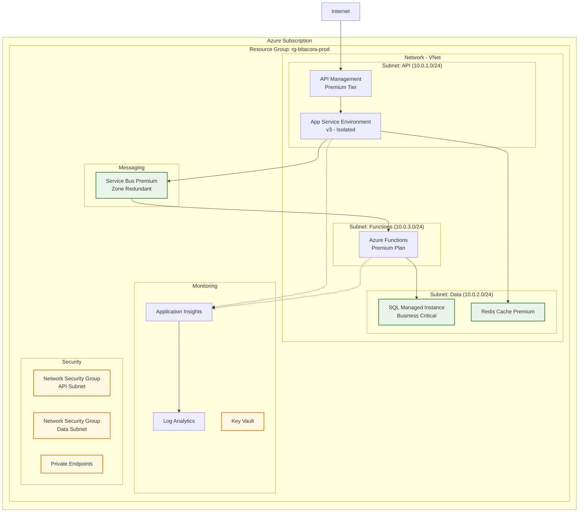
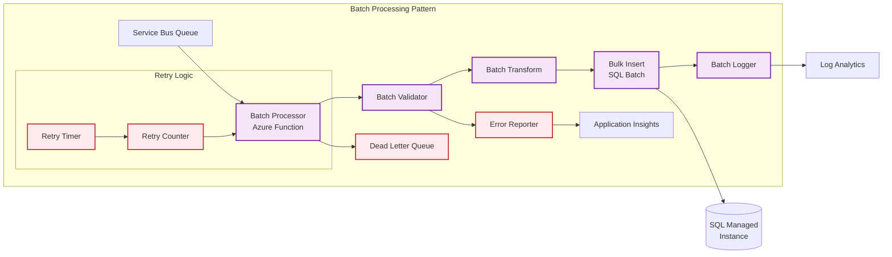
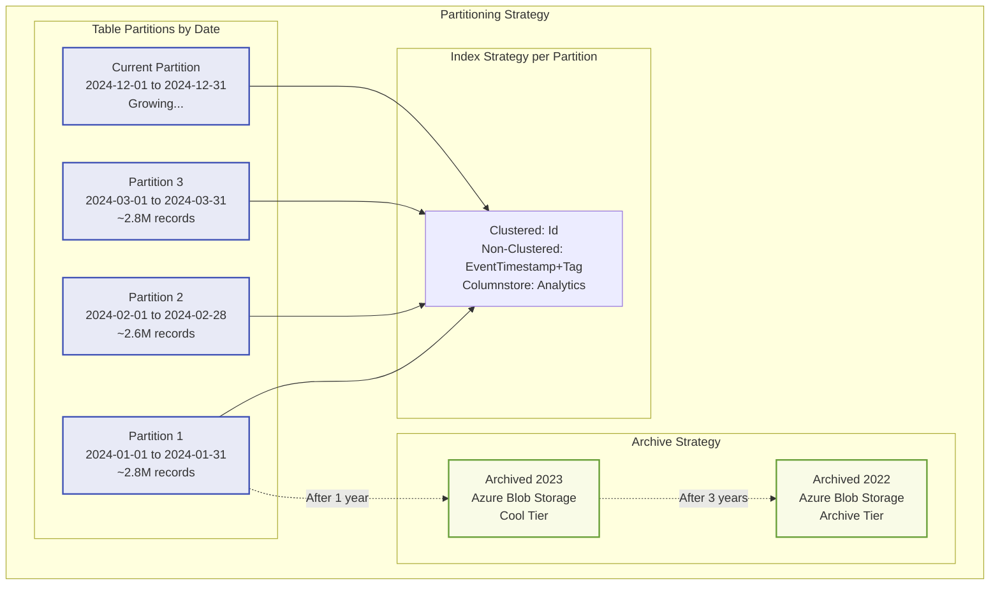
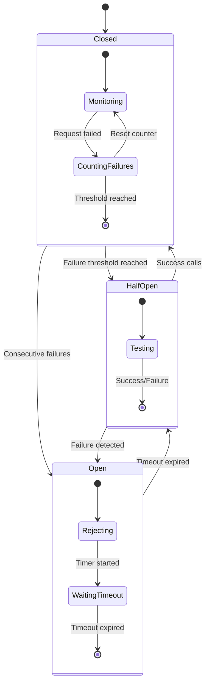
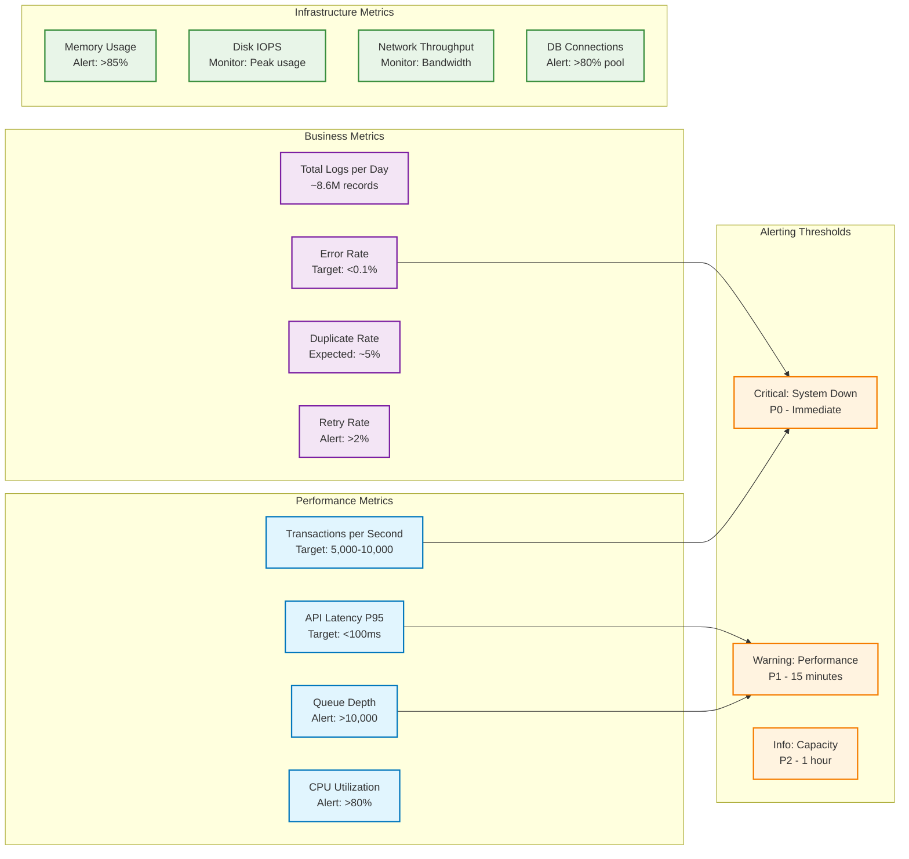
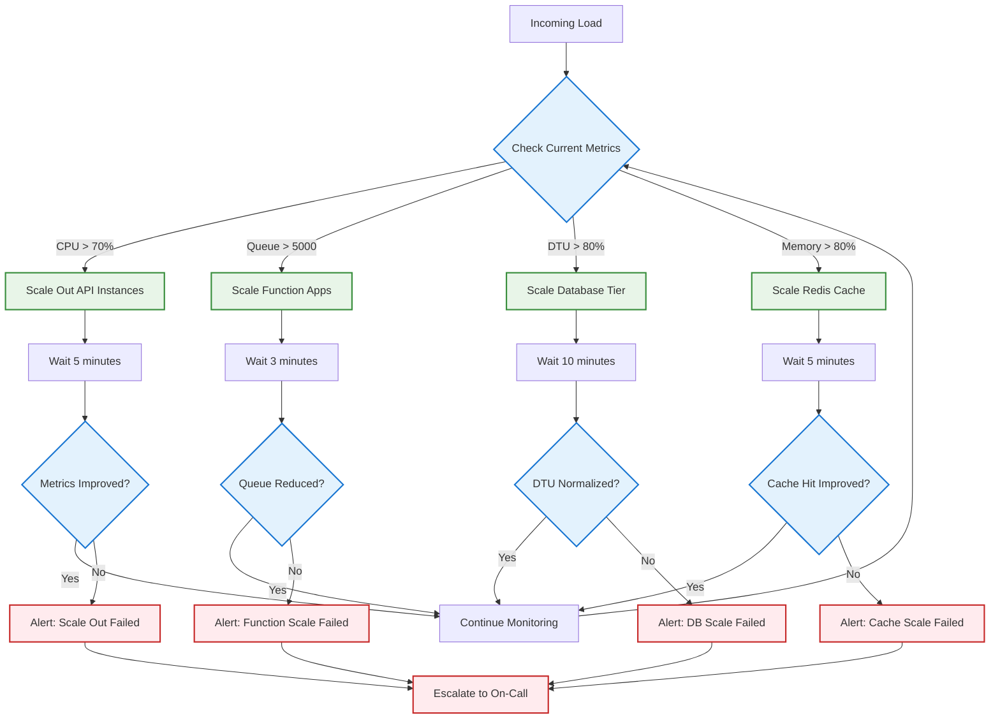
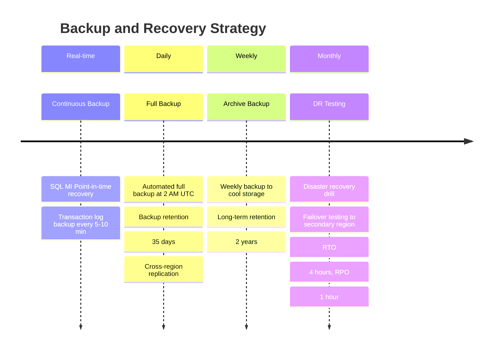

# Diagramas Complementarios - API de Bitácora

## Diagrama de Deployment y Infraestructura

## Patrón de Procesamiento por Lotes (Batch Processing)

## Estrategia de Particionamiento de Datos

## Patrón de Circuit Breaker y Resiliencia

## Métricas y KPIs de Monitoreo

## Flujo de Escalamiento Automático

## Estrategia de Backup y Disaster Recovery

---

## Checklist de Implementación

### Fase 1: Infraestructura Base (Semana 1-2)
- [ ] Crear Resource Groups y VNets
- [ ] Configurar Azure SQL Managed Instance
- [ ] Implementar Azure Service Bus Premium
- [ ] Configurar Redis Cache Premium
- [ ] Establecer conectividad privada (Private Endpoints)

### Fase 2: Aplicación API (Semana 3-4)  
- [ ] Desarrollar API .NET Core con patrones async
- [ ] Implementar middleware de rate limiting
- [ ] Configurar deduplicación con Redis
- [ ] Integrar con Service Bus para encolamiento
- [ ] Implementar health checks y métricas

### Fase 3: Procesamiento Asíncrono (Semana 5-6)
- [ ] Desarrollar Azure Functions para procesamiento
- [ ] Implementar batch processing con retry logic
- [ ] Configurar dead letter queues
- [ ] Optimizar bulk inserts a SQL MI
- [ ] Implementar circuit breaker pattern

### Fase 4: Monitoreo y Observabilidad (Semana 7-8)
- [ ] Configurar Application Insights
- [ ] Crear dashboards en Log Analytics  
- [ ] Implementar alertas proactivas
- [ ] Configurar métricas personalizadas
- [ ] Establecer runbooks de incidentes

### Fase 5: Optimización y Tuning (Semana 9-10)
- [ ] Implementar particionamiento de tablas
- [ ] Optimizar índices y queries
- [ ] Configurar auto-scaling policies  
- [ ] Realizar pruebas de carga
- [ ] Ajustar parámetros de rendimiento

¿Te gustaría que profundice en alguna fase específica o que creemos los scripts de implementación para algún componente?